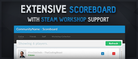
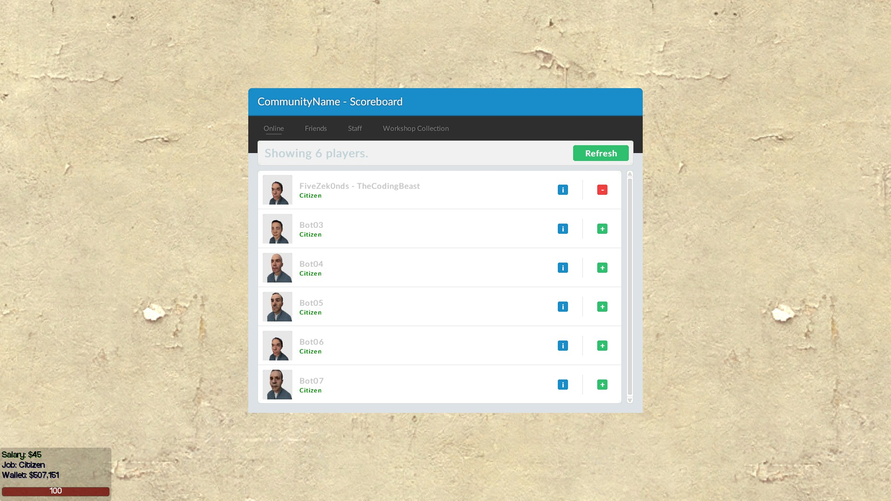
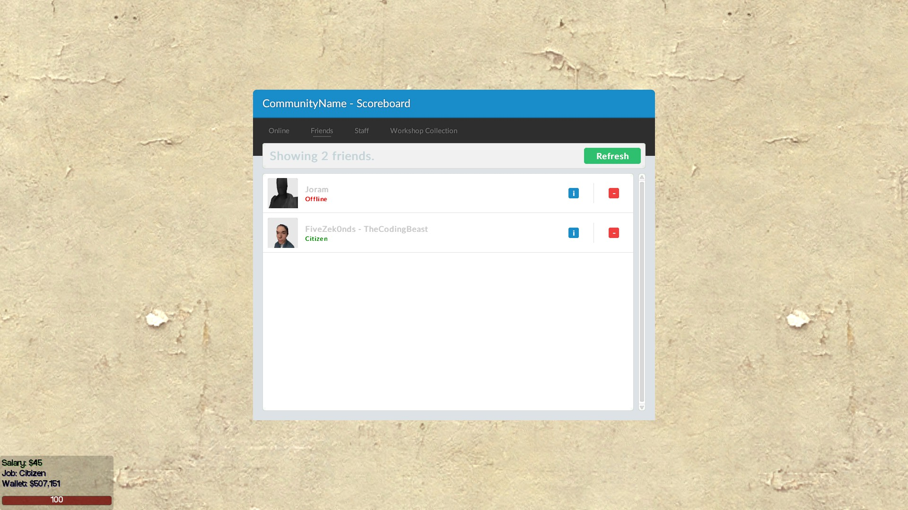
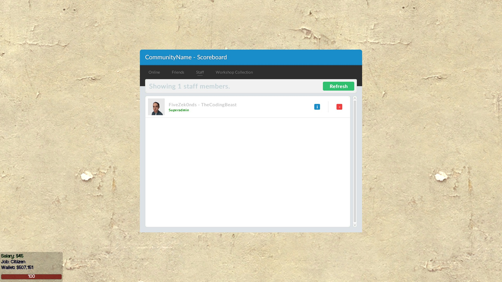
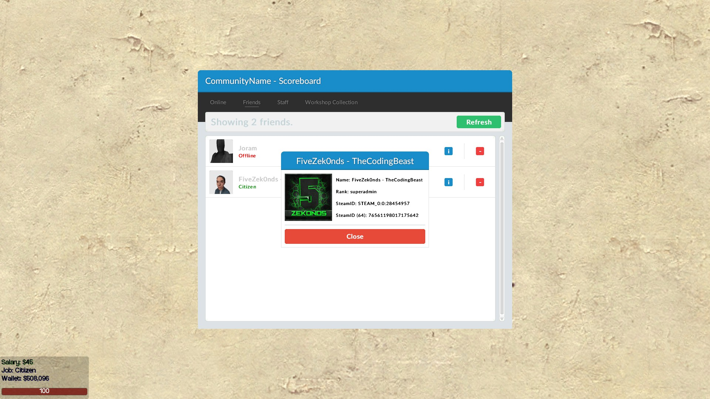
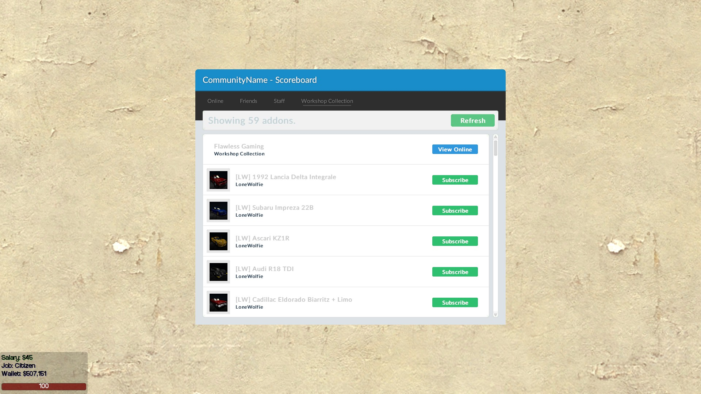
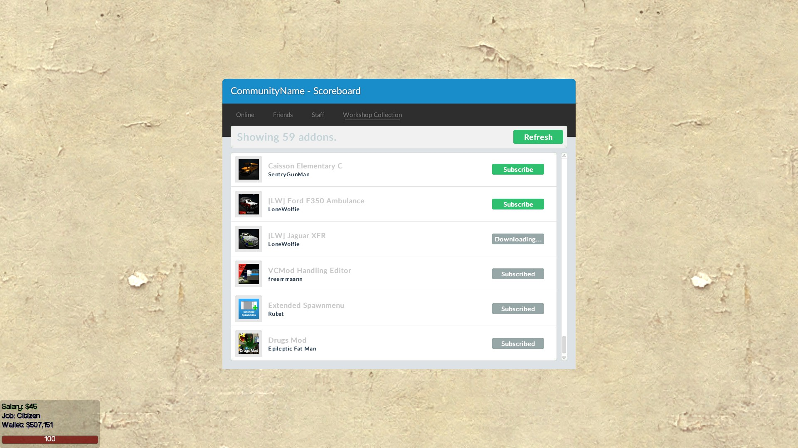
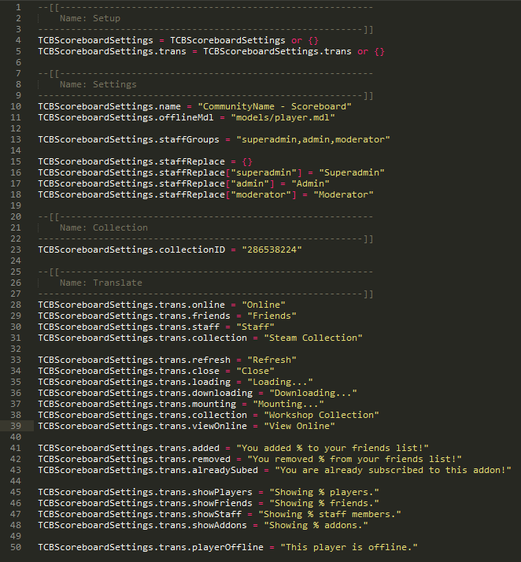
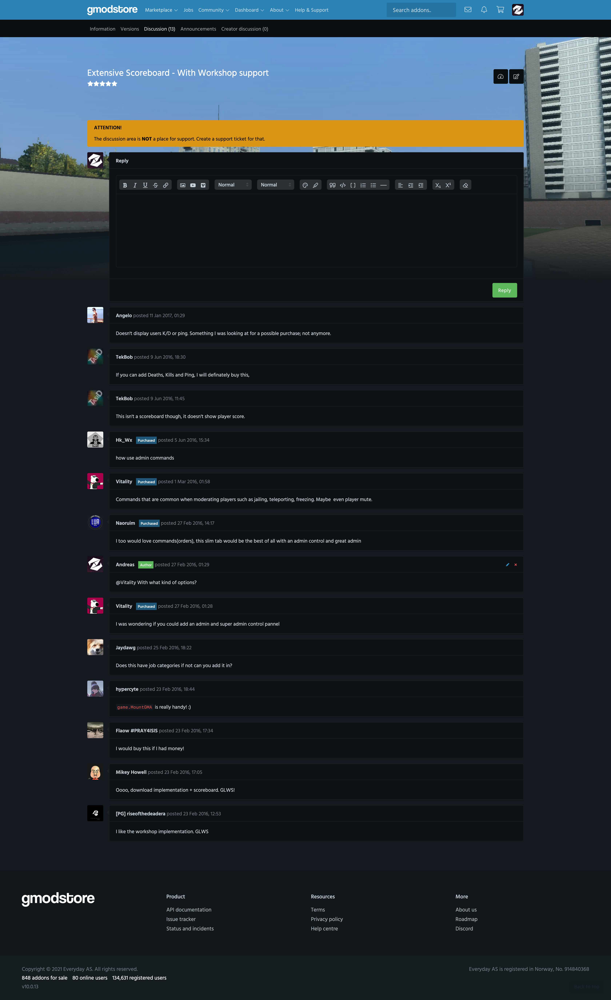
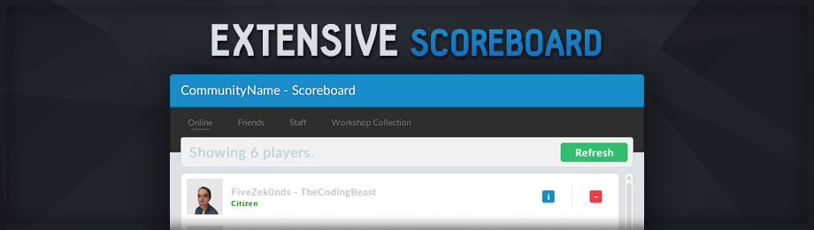

# Extensive Scoreboard - With Workshop support (1.0.1)

> [GmodStore Product Page](https://www.gmodstore.com/market/view/tcb-premium-extensive-scoreboard)
Sales: 144  | Price: 4.99 USD
Added: 23 Feb 2016, 02:22
Updated: 23 Feb 2016, 15:31

Extensive Scoreboard is a replacement scoreboard for the default DarkRP scoreboard. This scoreboard comes with additional features such as Friends and Workshop collection.

## Requirements
- DarkRP 2.5 and higher
- DarkRP Modification

## Features
- Player card showing the most important information.
- Player friends so you can easily see if your friends is online.
- Workshop collection download using the new game.MountGMA to mount files instantly.
- Integrated with the DarkRP database system.

## Installation
1. Upload the 'tcb_extensive_scoreboard' folders to 'garrysmod/addons/darkrpmodification/lua/darkrpmodules'.
2. Change the settings in the 'sh_config.lua' file.
3. Restart the server.

## Media
|  |   |   | 
|---|---|---|---|
|  |    |    | 
|  |     |     | 
