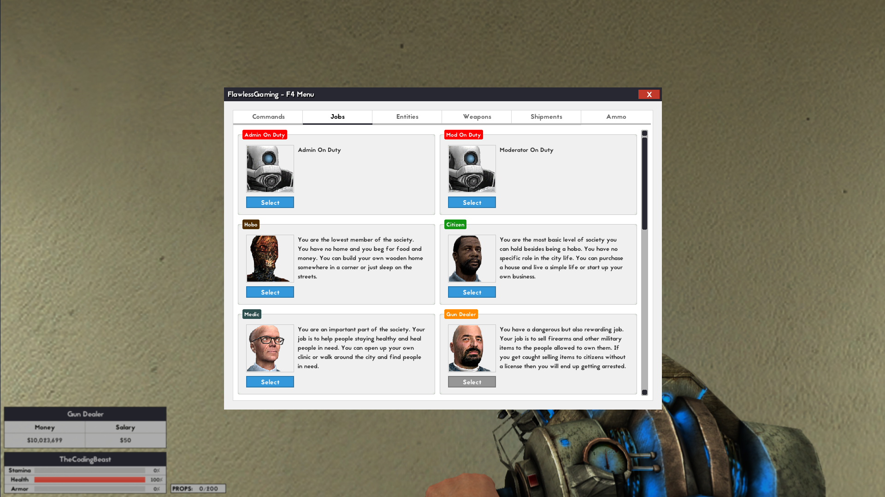
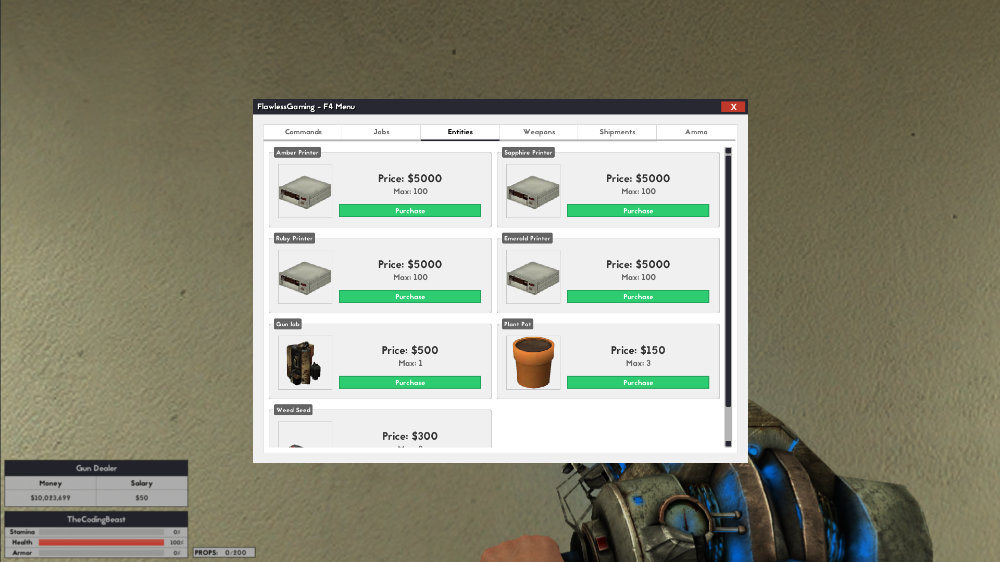
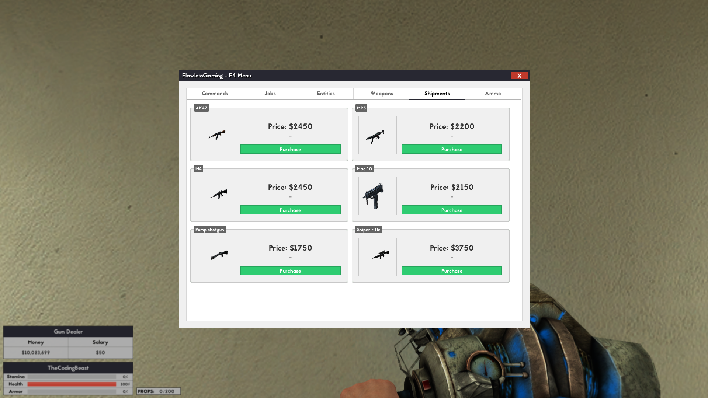
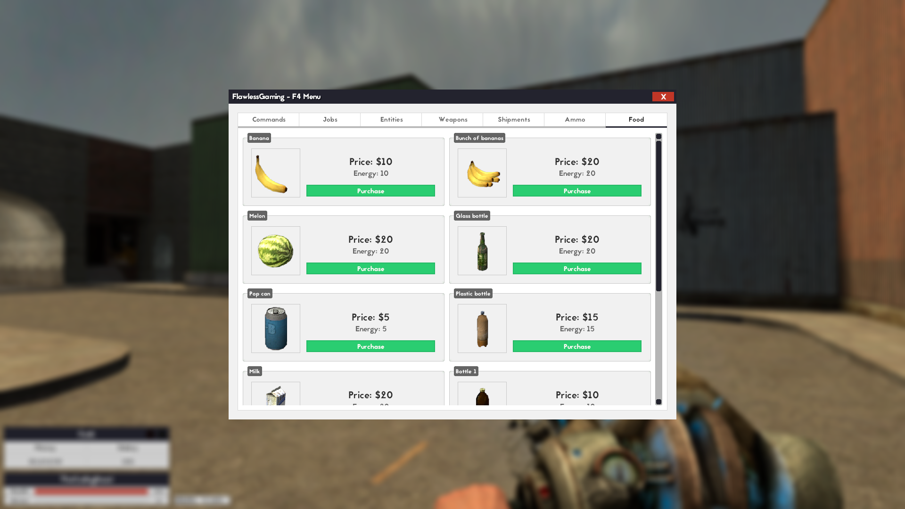
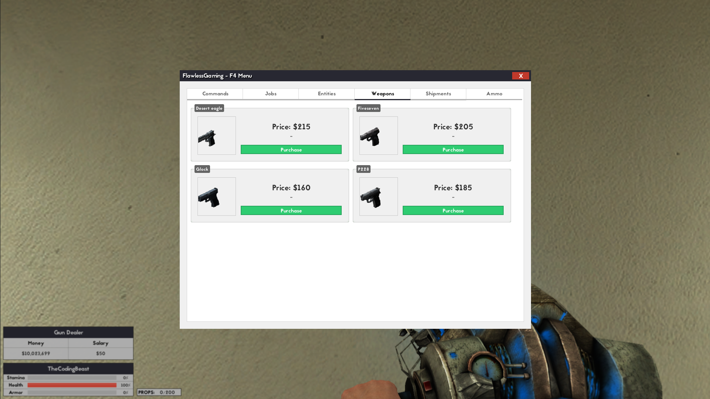
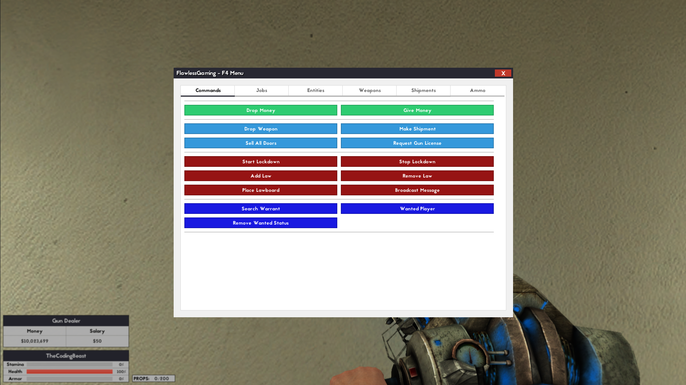
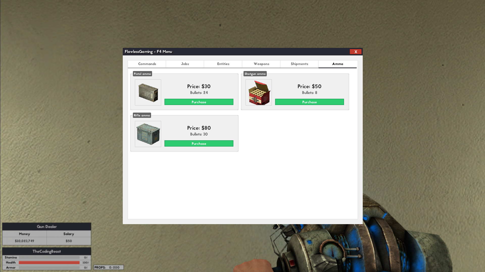
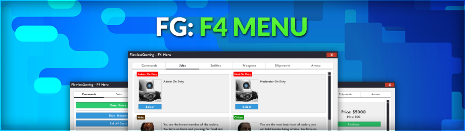
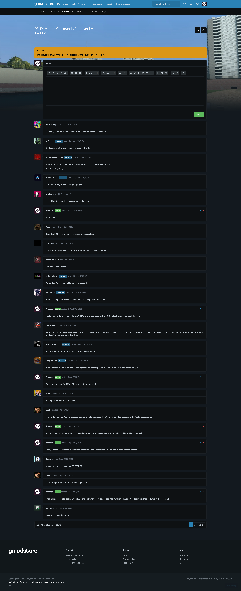
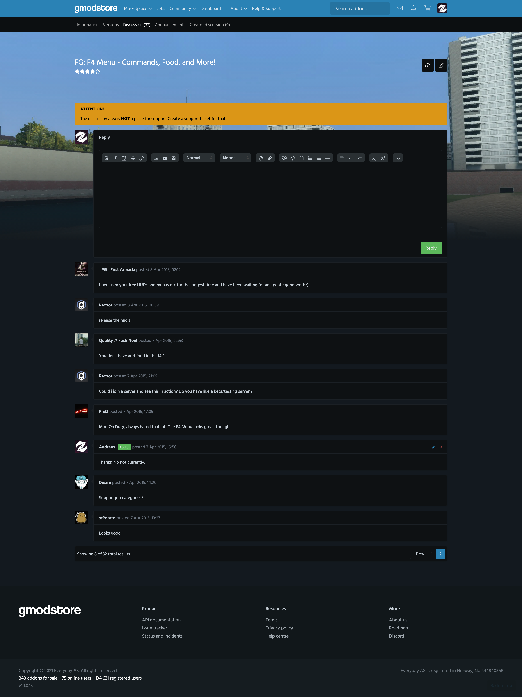

# FG: F4 Menu - Commands, Food, and More! (1.4)

> [GmodStore Product Page](https://www.gmodstore.com/market/view/tcb-premium-fg-f4menu)  
Sales: 378  | Price: 7.50 USD  
Added: 7 Apr 2015, 13:20  
Updated: 4 Sept 2015, 19:28

FG F4Menu is a clean and simple replacement for the default DarkRP F4 menu with a list of other addons matching the same design.

## Requirements
- DarkRP 2.5 and higher
- DarkRP Modification

## Tabs
The following tabs is available:
- Commands (drop money, wanted player, etc)
- Jobs
- Entities
- Weapons
- Shipments
- Ammo
- Food (requires Hungermod enabled)

## Installation
1. Upload the 'resource' folder to the main Garry's mod folder 'garrysmod/'.
2. Upload the 'fg_f4menu' and 'fg_vgui' folders to 'garrysmod/addons/darkrpmodification/lua/darkrpmodules/'.
3. Disable the default DarkRP F4Menu in 'garrysmod/addons/darkrpmodification/lua/darkrp_config/disabled_defaults.lua'.
4. Change the server name in 'fg_f4menu/cl_frame.lua' on line 22.
5. Sync the FastDL server with the new font (skip if sv_allowdownload is enabled - not suggested)
6. Restart the server.

## Media
|  |   |   | 
|---|---|---|---|
|  |    |    | 
|  |     |     |   
| 
