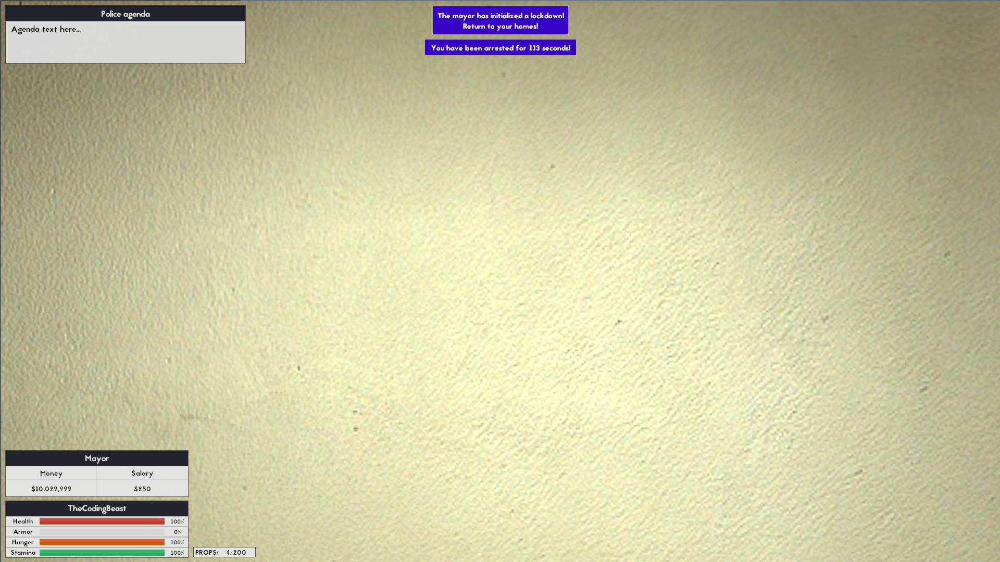
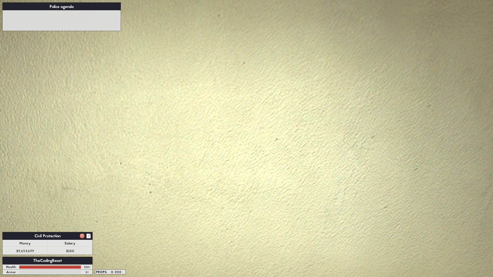
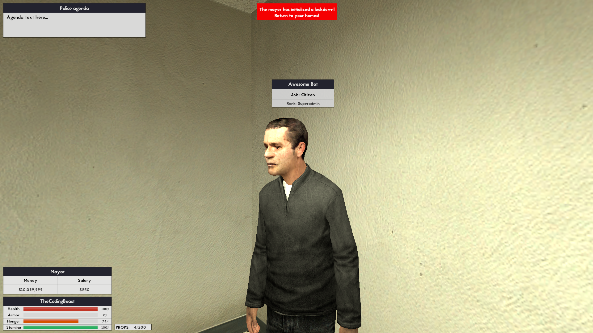
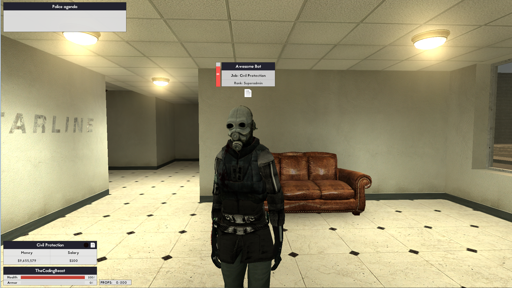
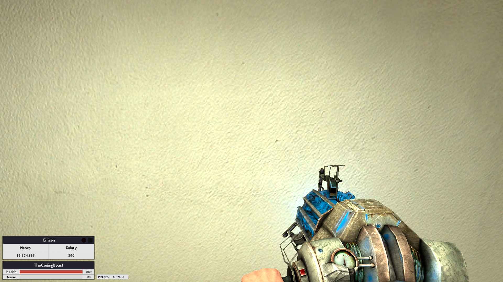
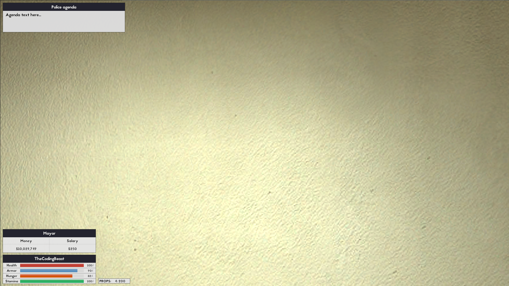
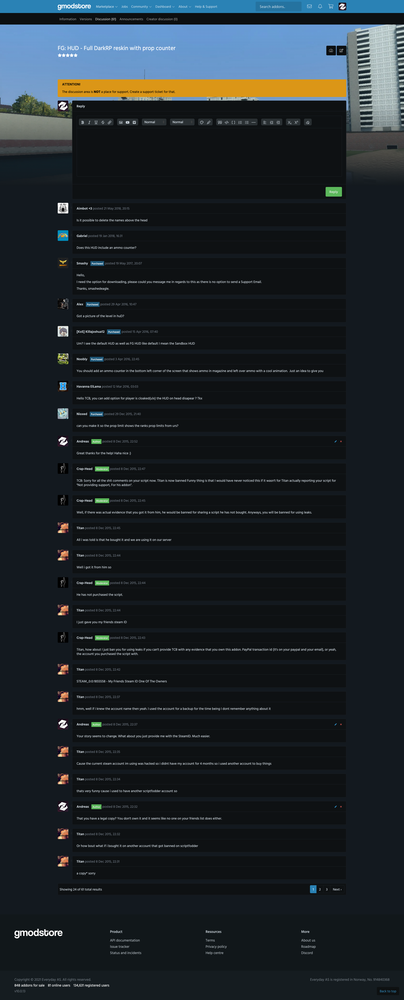
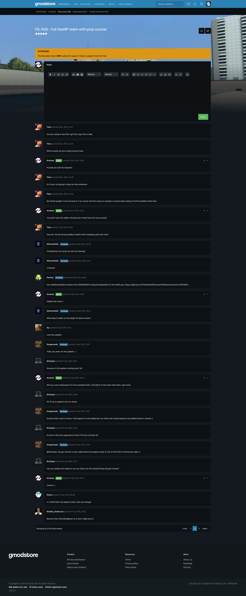
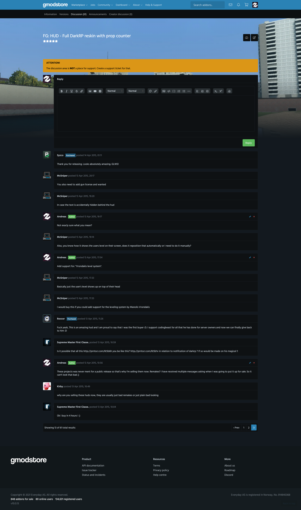

# FG: HUD - Full DarkRP reskin with prop counter (1.4)

> [GmodStore Product Page](https://www.gmodstore.com/market/view/tcb-premium-fg-hud)  
Sales: 459  | Price: 4.99 USD  
Added: 13 Apr 2015, 09:42  
Updated: 18 Nov 2015, 20:43

FG HUD is a clean and simple replacement for the default DarkRP HUD with a list of other addons matching the same design.

## Requirements
- DarkRP 2.5 and higher
- DarkRP Modification

## Elements
The following elements is redesigned:
- On-screen player HUD
- Player overhead hud
- Lockdown and Arrested display

## Modules
The addon provides support for the following modules:
- Hungermod (Requirement: Enabled in disabled_defaults)
- Stamina (Requirement: TCB Stamina installed - [http://www.thecodingbeast.com/products](http://www.thecodingbeast.com/products))
- Level (Requirement: Vrondakis level system installed - [https://github.com/vrondakis/DarkRP-Leveling-System](https://github.com/vrondakis/DarkRP-Leveling-System))

## Installation
1. Upload the 'resource' folder to the main Garry's mod folder 'garrysmod/'.
2. Upload the 'fg_hud' and 'fg_vgui' folders to 'garrysmod/addons/darkrpmodification/lua/darkrpmodules/'.
3. Sync the FastDL server with the new font (skip if sv_allowdownload is enabled - not suggested)
4. Restart the server.

## Media
|  |   |   | 
|---|---|---|---|
|  |    |    | 
|  |     |     |   
| 
