# FG: Printers - Upgradable, Power, and Temperature (1.9.2)

> [GmodStore Product Page](https://www.gmodstore.com/market/view/tcb-premium-fg-printers)  
Sales: 1,172  | Price: 4.99 USD  
Added: 14 Apr 2015, 09:04  
Updated: 3 Nov 2016, 23:07

FG Printers is an advanced replacement for the default DarkRP Printers with a list of other addons matching the same design.

## Requirements
- DarkRP 2.5 and higher
- DarkRP Modification

## Features
The printers have the following features:
- Fully upgradable (Speed, Quality, and Cooler).
- Power and Temperature.
- Easy additional printers.
- And much more!

## Configuration
The default settings and descriptions of them are available in 'darkrpmodification/lua/entities/fg_base_printer/shared.lua'

Settings for each printer is available in 'darkrpmodification/lua/entities/fg_<name>_printer/shared.lua'

## Installation
1. Upload the 'resource', 'models', and 'materials' folders to the main Garry's mod folder 'garrysmod/'.
2. Upload the 'fg_vgui' folder to 'garrysmod/addons/darkrpmodification/lua/darkrpmodules/'.
3. Upload the 'entities' folder to 'garrysmod/addons/darkrpmodification/lua/'.
4. Copy and paste the code from 'entities.lua' into 'garrysmod/addons/darkrpmodification/lua/darkrp_customthings/entities.lua'
5. Configure the buy groups in the above file.
6. Configure the upgrade groups in 'garrysmod/addons/darkrpmodification/lua/entities/fg_base_printer/shared.lua'
7. Sync the FastDL server with the new font (skip if sv_allowdownload is enabled - not suggested)
8. Restart the server.

## Media
| 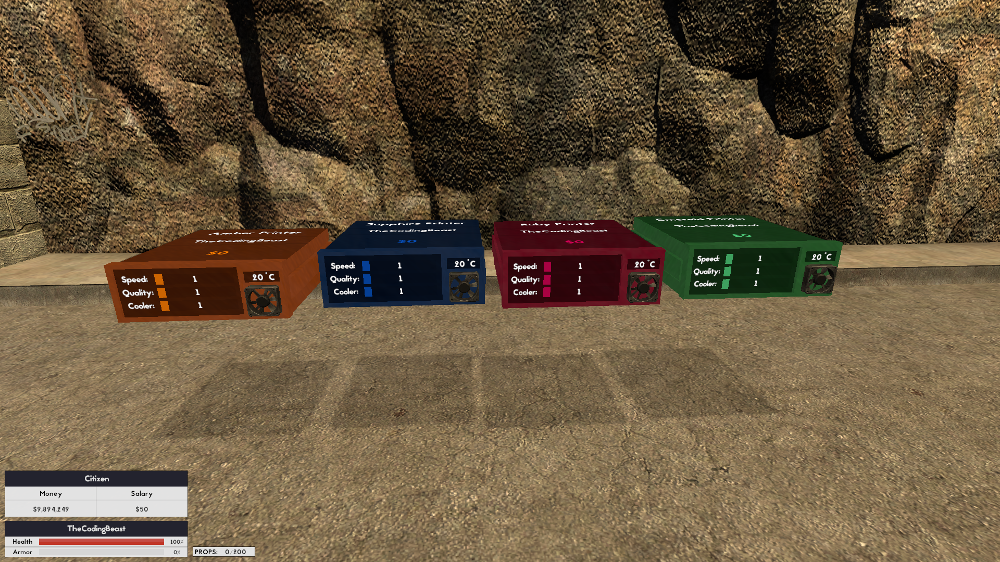 |  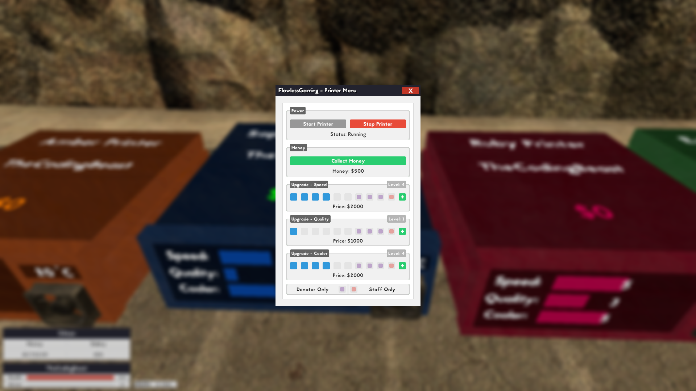 |  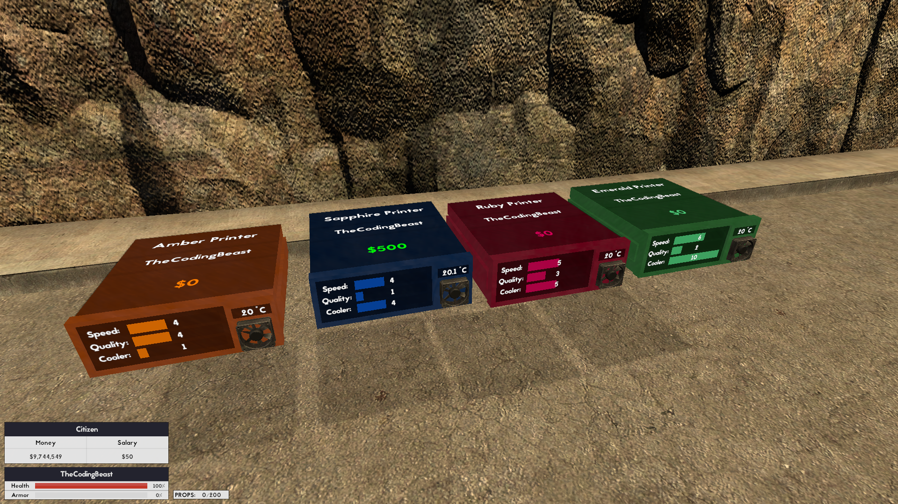 | 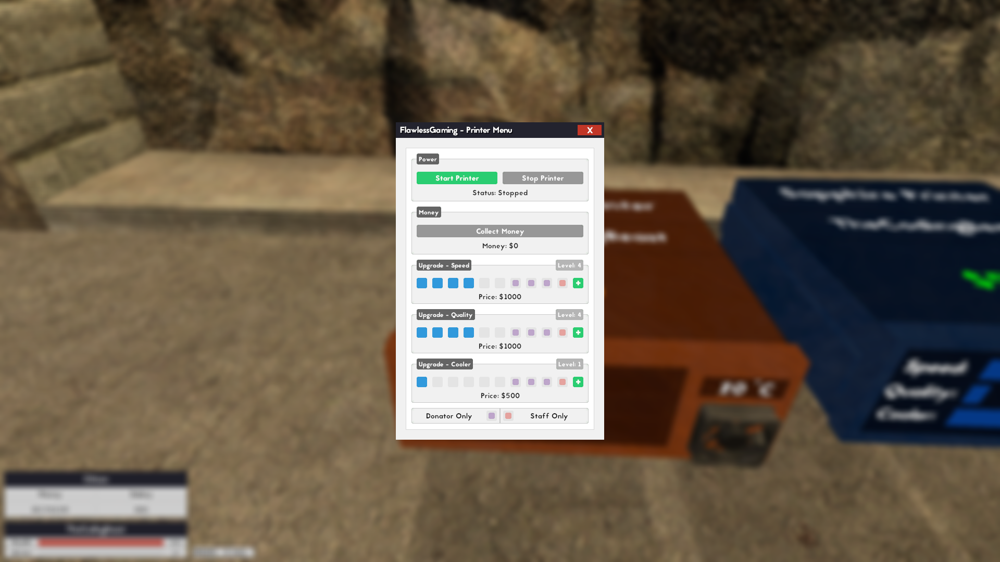
|---|---|---|---|
| 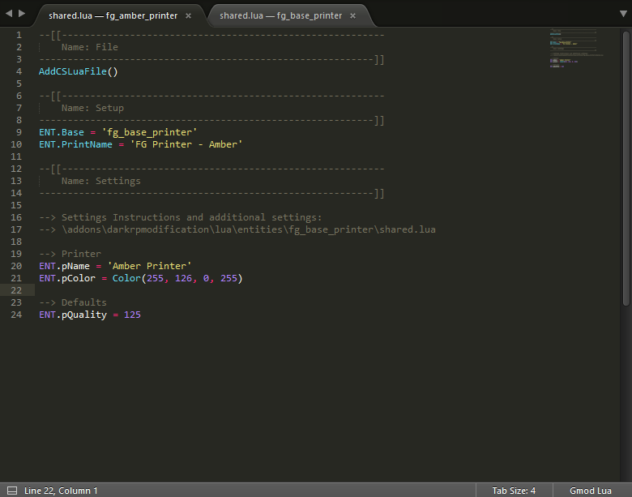 |  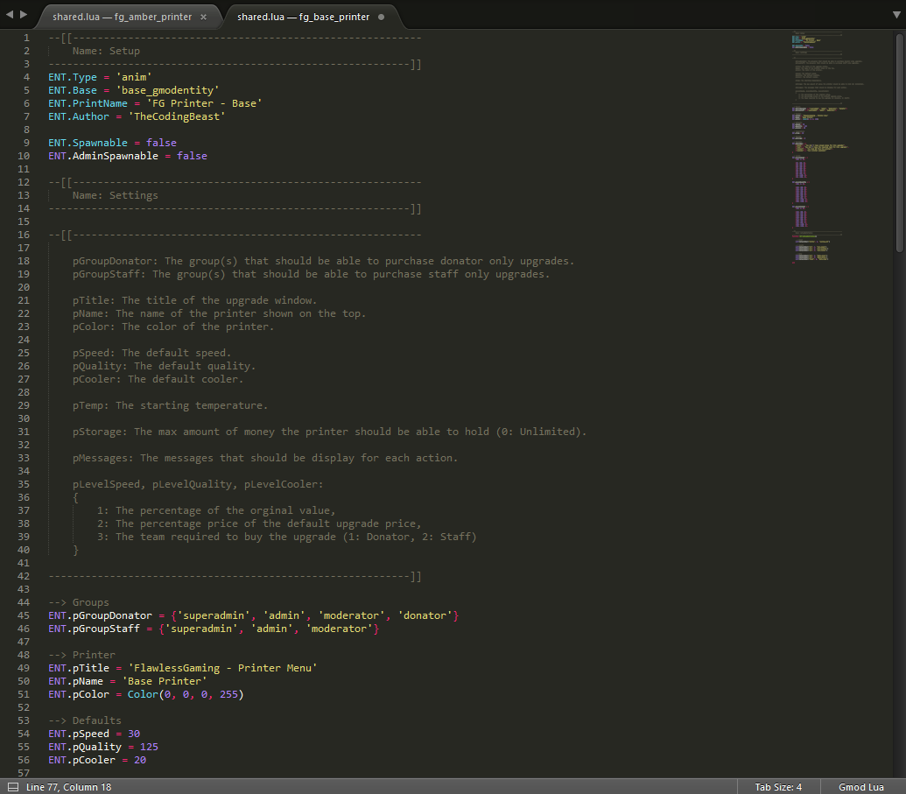  |    | 
|  |   |   |  
|  |   |   |  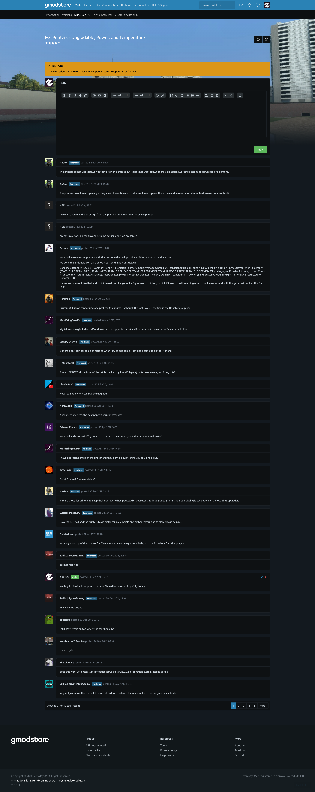 
|  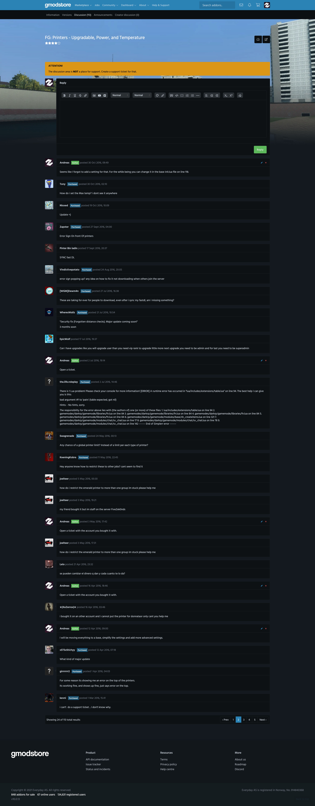 | 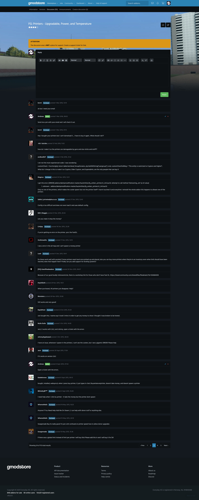 | 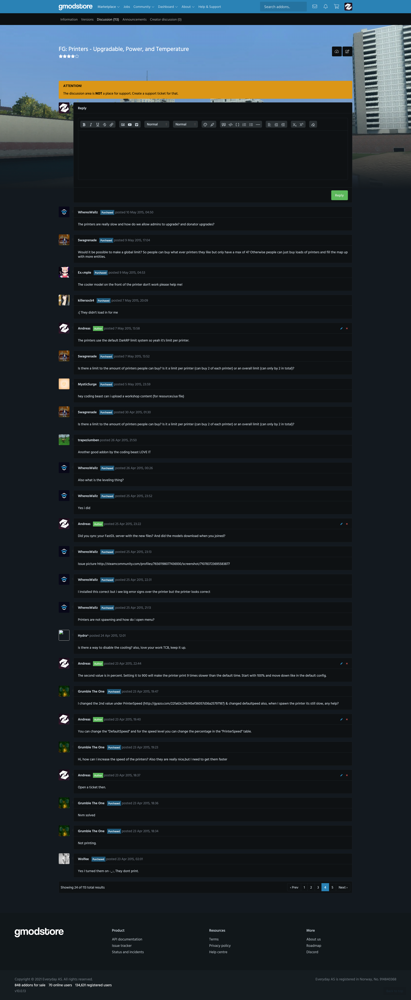 | 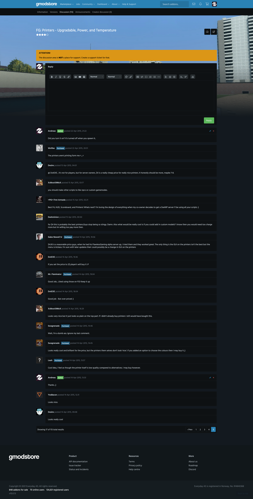
