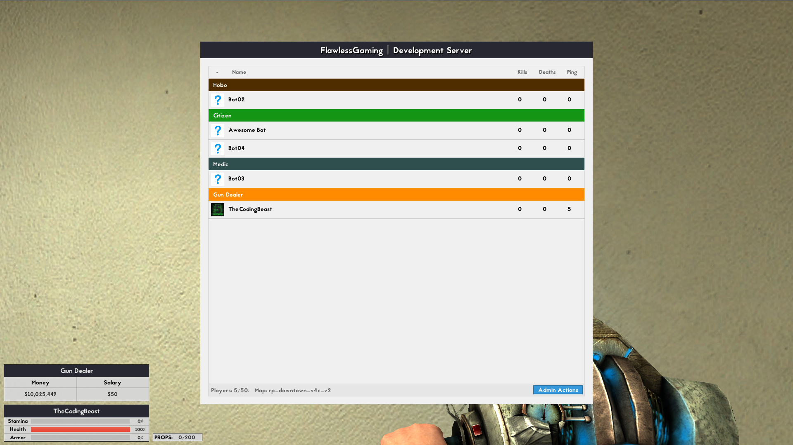
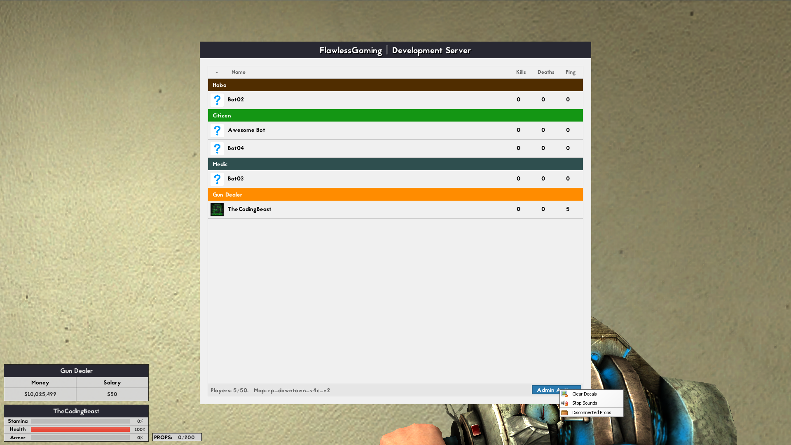
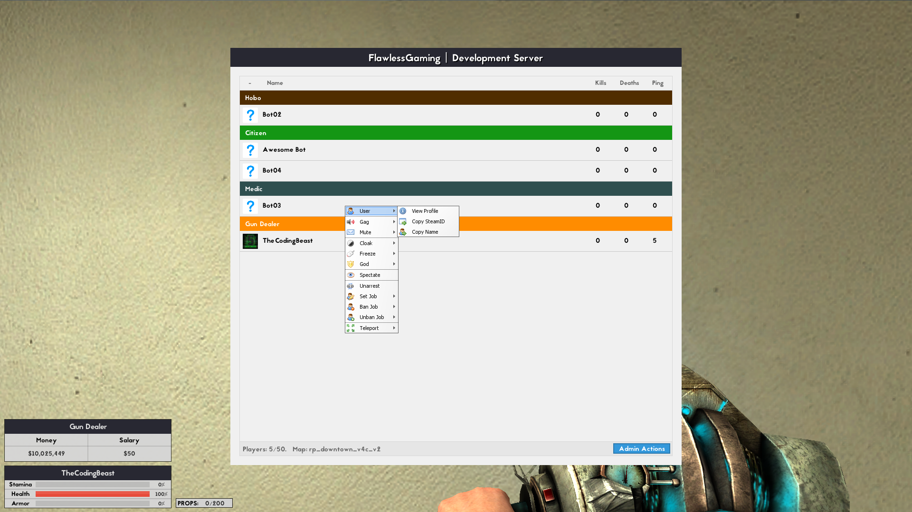
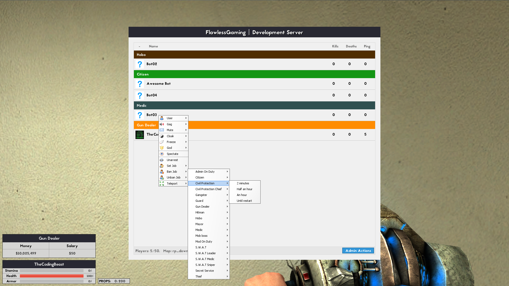
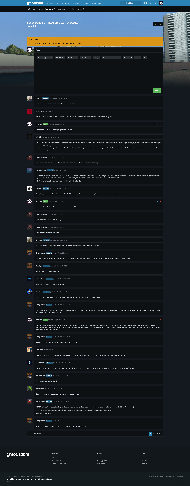
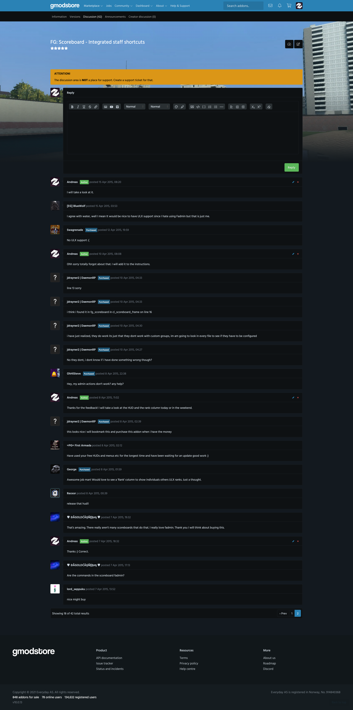
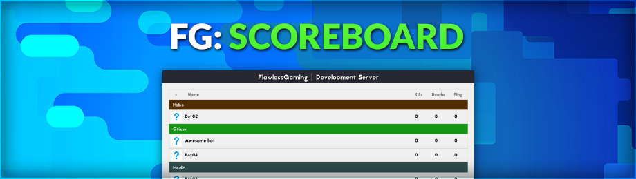

# FG: Scoreboard - Integrated staff shortcuts (1.1.1)

> [GmodStore Product Page](https://www.gmodstore.com/market/view/tcb-premium-fg-scoreboard)  
Sales: 385  | Price: 4.99 USD  
Added: 7 Apr 2015, 13:21  
Updated: 18 Feb 2016, 23:40

FG Scoreboard is a clean and simple replacement for the default DarkRP Scoreboard with a list of other addons matching the same design.

## Requirements
- DarkRP 2.5 and higher
- DarkRP Modification
- FAdmin Enabled

## Installation
1. Upload the 'resource' folder to the main Garry's mod folder 'garrysmod/'.
2. Upload the 'fg_scoreboard' and 'fg_vgui' folders to 'garrysmod/addons/darkrpmodification/lua/darkrpmodules/'.
3. Change the access groups in 'fg_scoreboard/cl_scoreboard_frame.lua' on line 13.
4. Sync the FastDL server with the new font (skip if sv_allowdownload is enabled - not suggested)
5. Restart the server.

## Media
|  |   |   | 
|---|---|---|---| 
|  |     |     |   
| 

