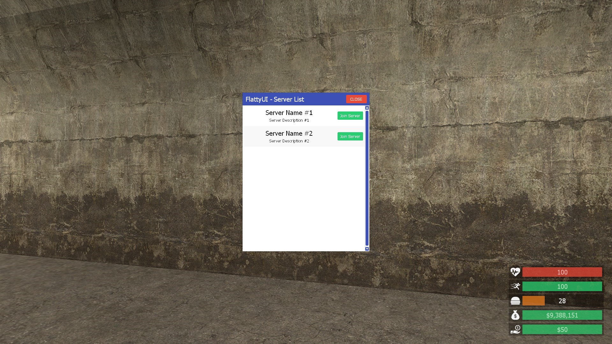
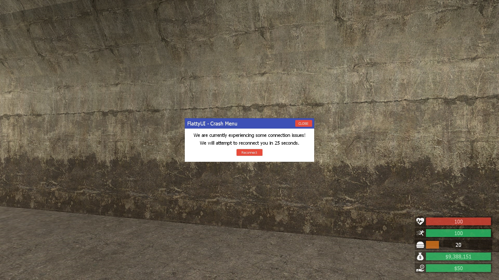
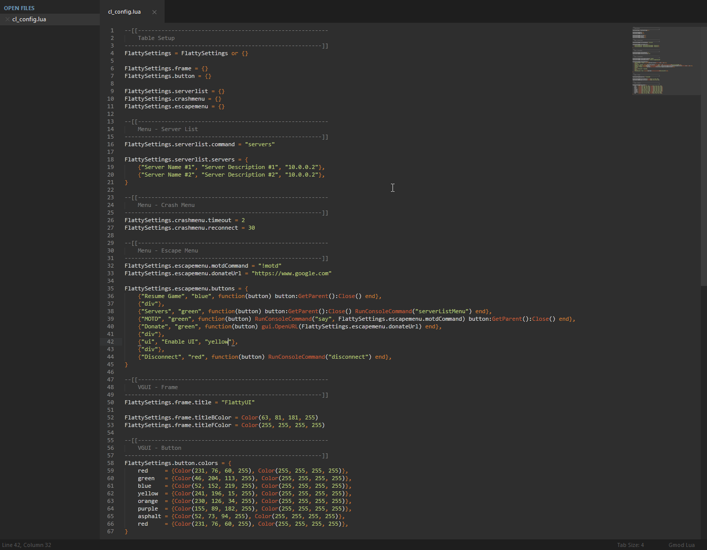
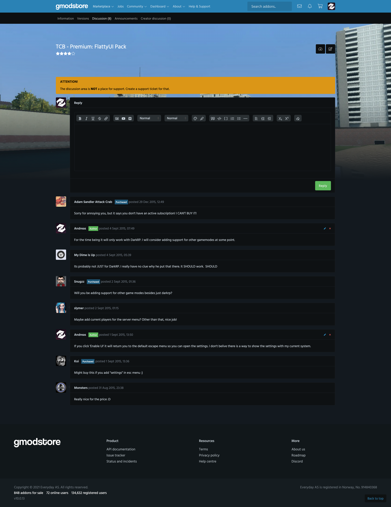

# TCB - Premium: FlattyUI Pack (1.4.2)

> [GmodStore Product Page](https://www.gmodstore.com/market/view/tcb-premium-flattyui-pack)  
Sales: 55  | Price: 4.99 USD  
Added: 31 Aug 2015, 19:34  
Updated: 18 Feb 2016, 23:57

TCB - Premium: Flatty Pack is a collection of 3 DarkRP modules in the same flat design.

## Requirements
- DarkRP 2.5 and higher
- DarkRP Modification

## Menues
1. Crash Screen
2. Server List
3. Escape Menu

## Installation
1. Upload all the folders to 'garrysmod/addons/darkrpmodification/lua/darkrp_modules/'.
2. Make your changes in 'flat_config/cl_config.lua'.
3. Restart the server.

## Media
|  |   |   | 
|---|---|---|---| 
|     |   

