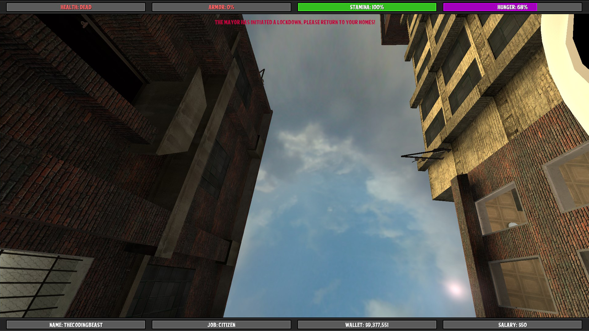
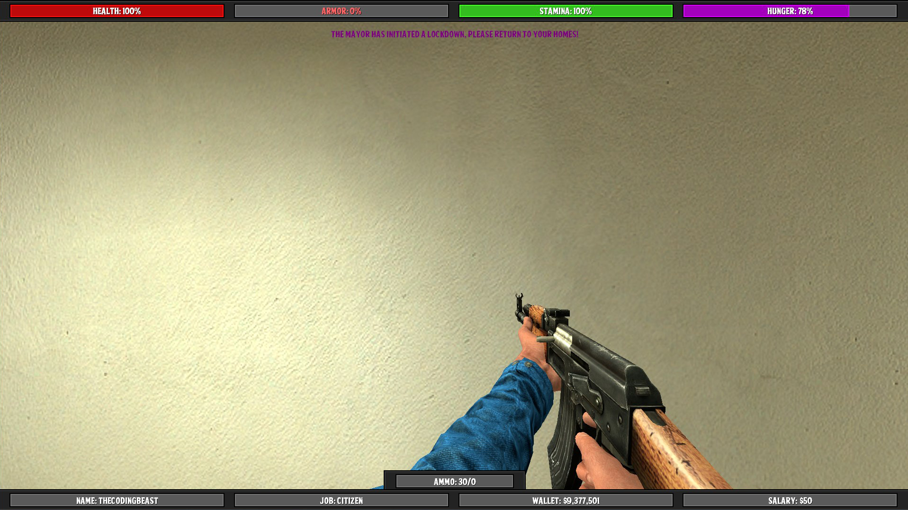
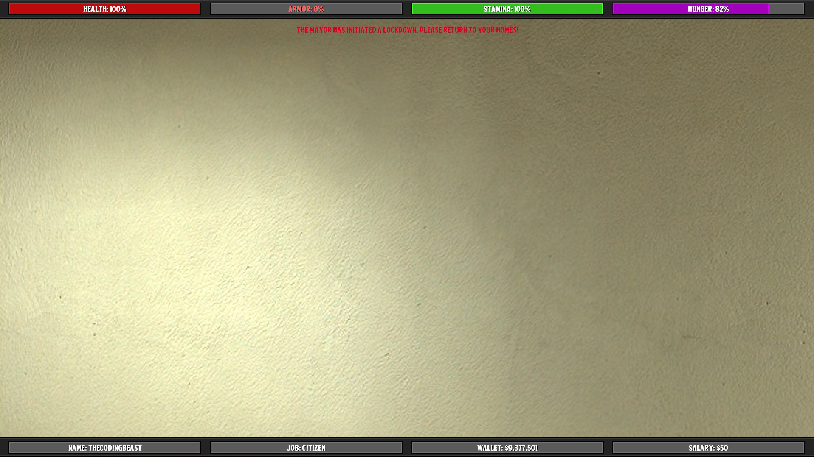
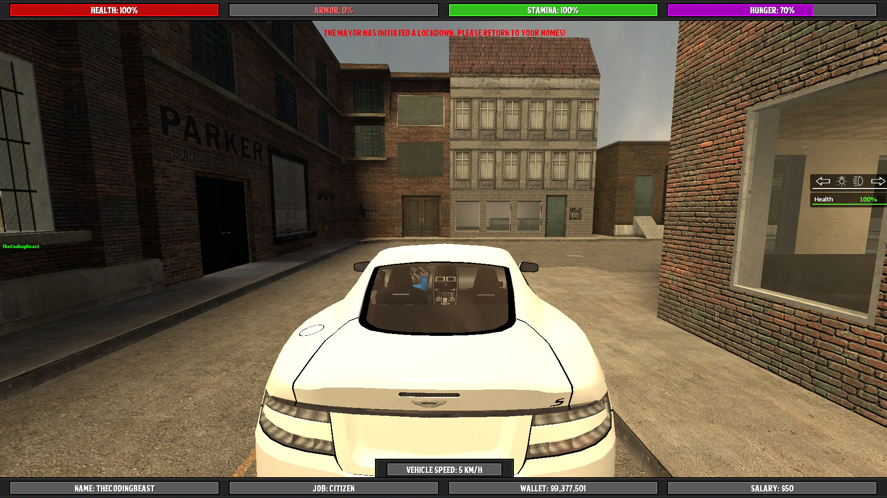
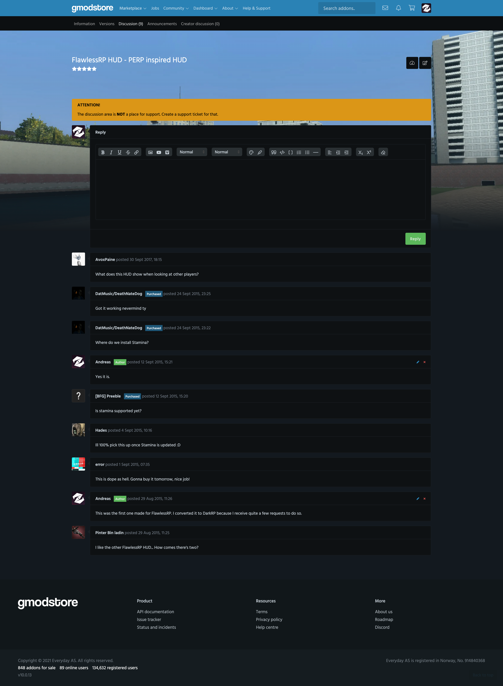
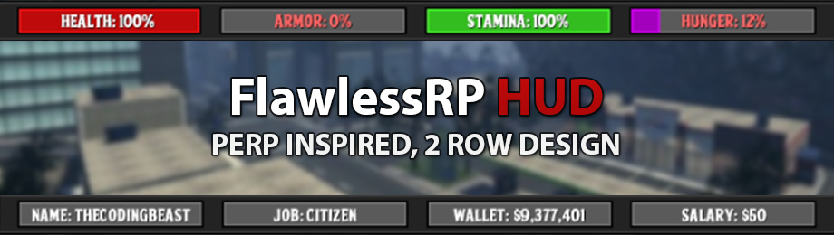

# FlawlessRP HUD - PERP inspired HUD (1.0.1)

> [GmodStore Product Page](https://www.gmodstore.com/market/view/tcb-premium-flawlessrp-hud)  
Sales: 151  | Price: 4.99 USD  
Added: 29 Aug 2015, 10:02  
Updated: 18 Oct 2016, 21:34

FlawlessRP HUD is a HUD originally made for a gamemode called FlawlessRP. After the project was stopped I received multiple requests to sell this HUD.

## Requirements
- DarkRP 2.5 and higher
- DarkRP Modification

## Modules
The addon provides support for the following modules:
- Hungermod (Requirement: Enabled in disabled_defaults)
- Stamina (Requirement: TCB Stamina installed - [http://www.thecodingbeast.com/products](http://www.thecodingbeast.com/products))
- Level (Requirement: Vrondakis level system installed - [https://github.com/vrondakis/DarkRP-Leveling-System](https://github.com/vrondakis/DarkRP-Leveling-System))

## Installation
1. Upload the 'resource' folder to the main Garry's mod folder 'garrysmod/'.
2. Upload the 'fgrp_hud' folder to 'garrysmod/addons/darkrpmodification/lua/darkrpmodules/'.
3. Sync the FastDL server with the new font (skip if sv_allowdownload is enabled - not suggested)
4. Restart the server.

## Media
|  |   |   | 
|---|---|---|---| 
|     |    |   

