# ManiaF4 Menu - Categories, searching and more! (1.0.5)

> [GmodStore Product Page](https://www.gmodstore.com/market/view/maniaf4-categories-searching-and-more)  
Sales: 188  | Price: 6.50 USD  
Added: 2 Sept 2016, 21:47  
Updated: 13 Sept 2017, 18:01

ManiaF4 is a modern replacement for the default DarkRP F4 menu with support for DarkRP categories and Hungermod.  
Video: [ManiaF4 - Demonstration](https://www.youtube.com/watch?v=33KU1bRpLgg)

## Requirements
- DarkRP 2.5 and higher
- DarkRP Modification

## Features
- Fully compatible with DarkRP Categories & HungerMod (Food).
- Easily customisable including color, tabs, commands and more.
- Easy navigation with search options.x
- Workshop download for materials.
- Smooth and neat animations.

## Installation
1. Upload the 'mania_resources' folder to 'garrysmod/addons/'.
2. Upload the 'mania_f4' and 'mania_ui' folders to 'garrysmod/addons/darkrpmodification/lua/darkrpmodules/'.
3. Disable the default DarkRP F4Menu in 'garrysmod/addons/darkrpmodification/lua/darkrp_config/disabled_defaults.lua'.
4. Sync the FastDL server with the new font (skip if sv_allowdownload is enabled - not suggested)
5. Restart the server.

## Media
| 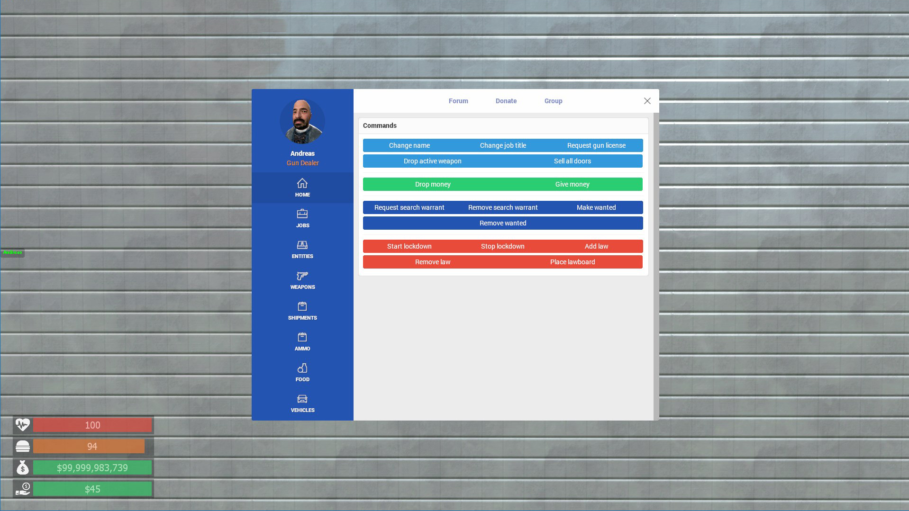 |  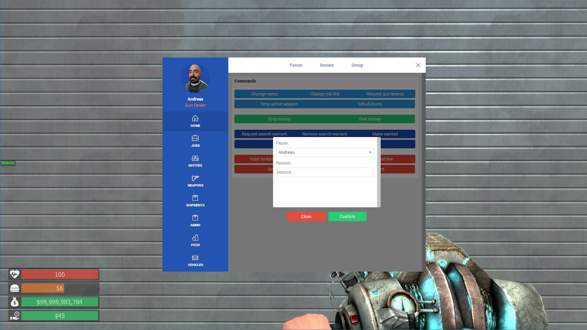 |  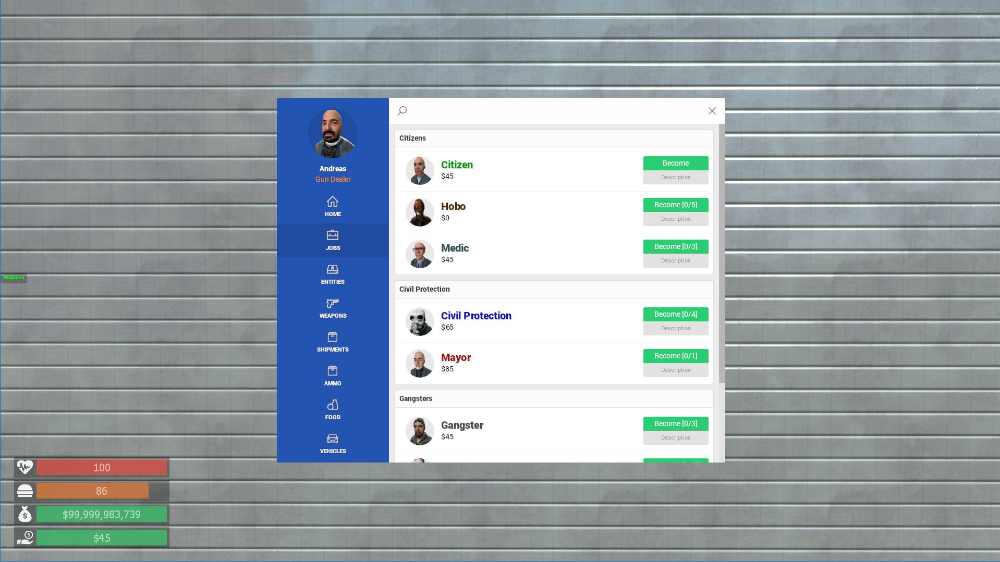 | 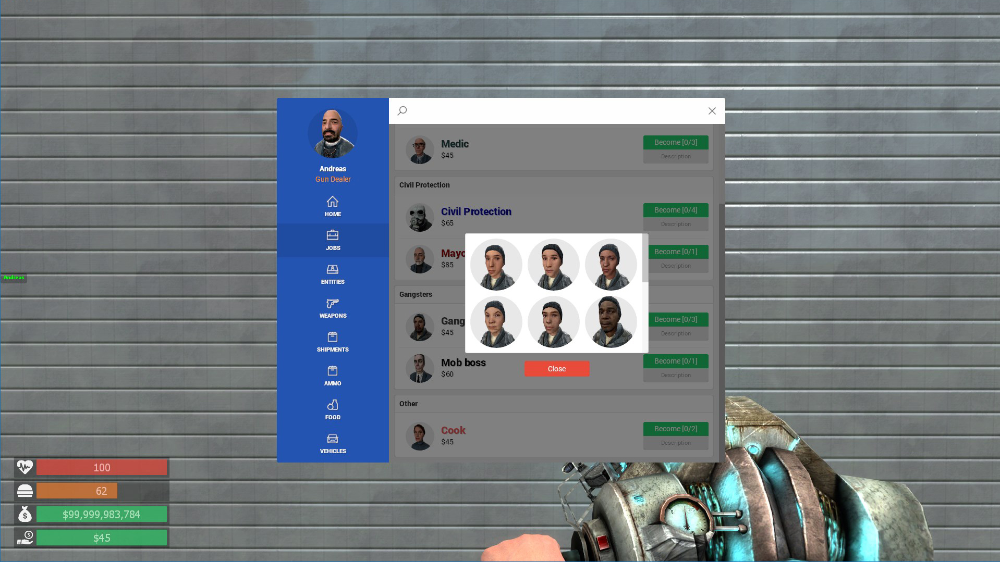
|---|---|---|---|
| 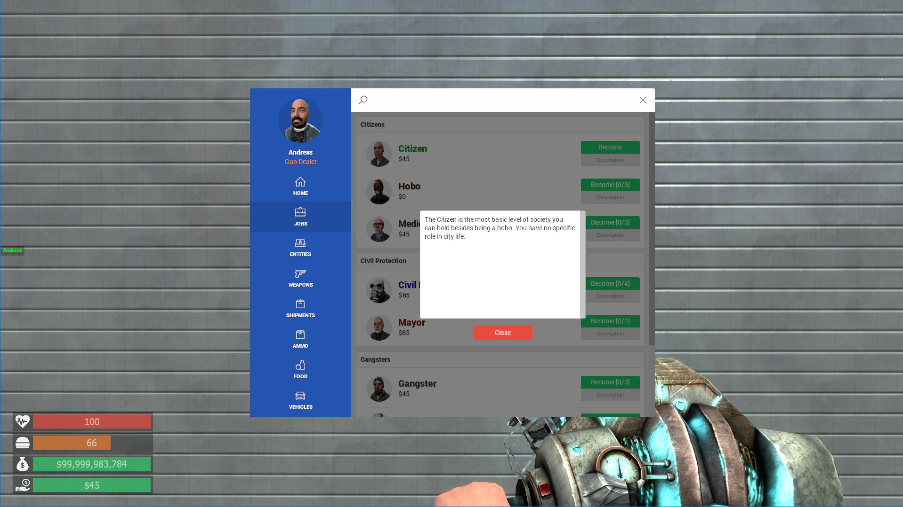 |  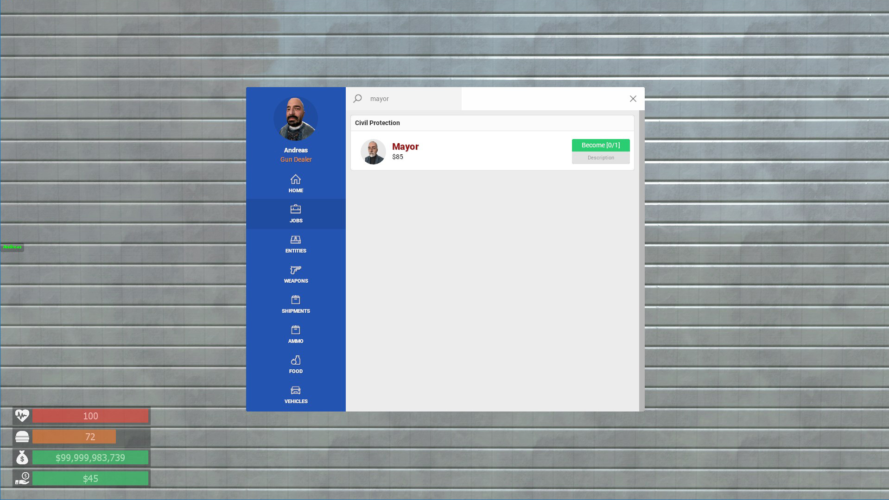 |  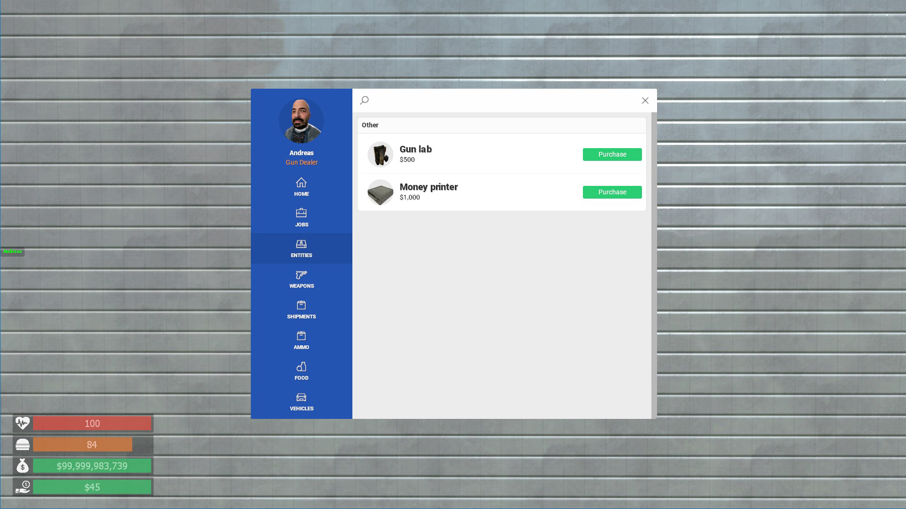 | 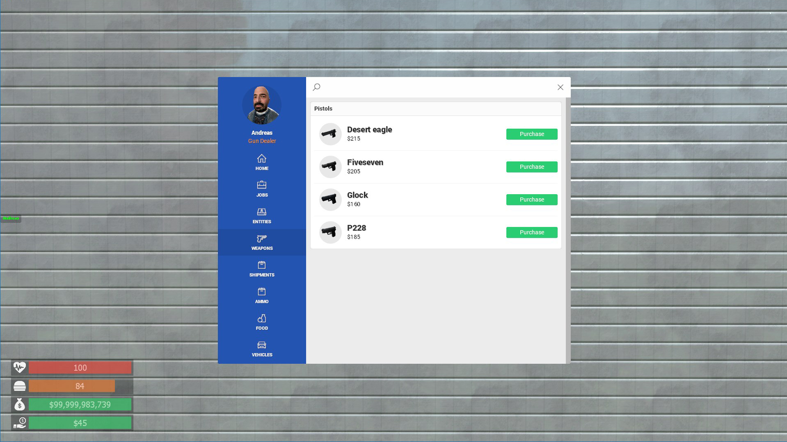
| 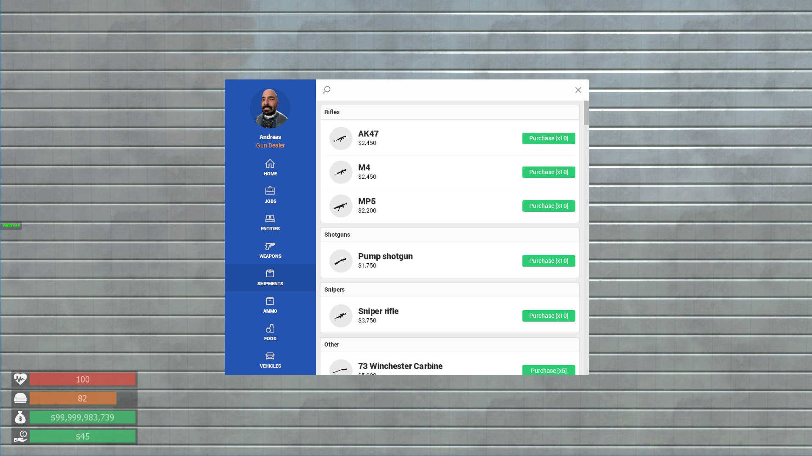    |  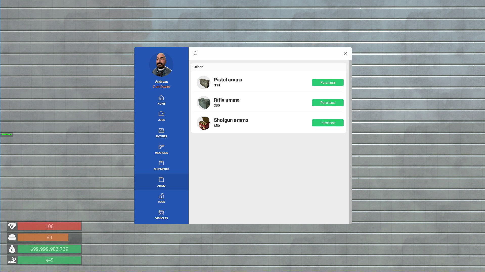  |  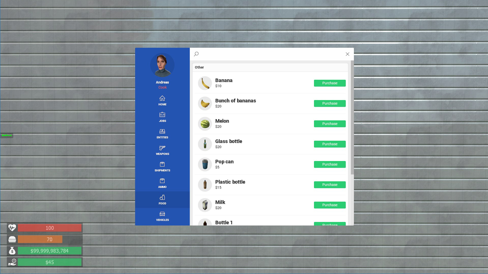 | 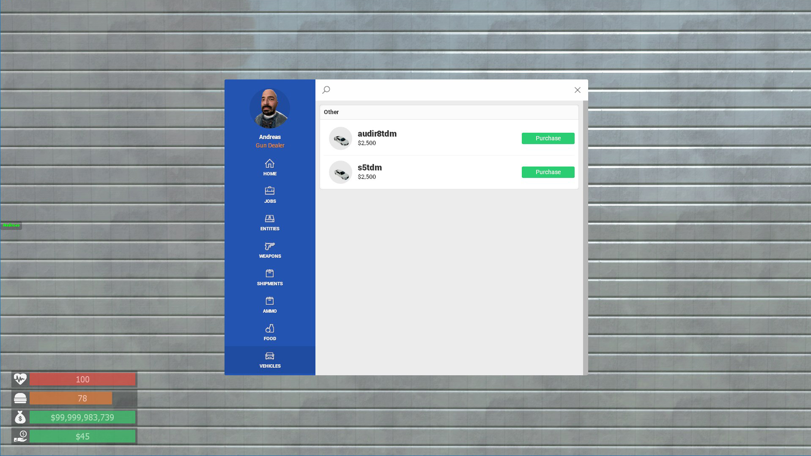
| 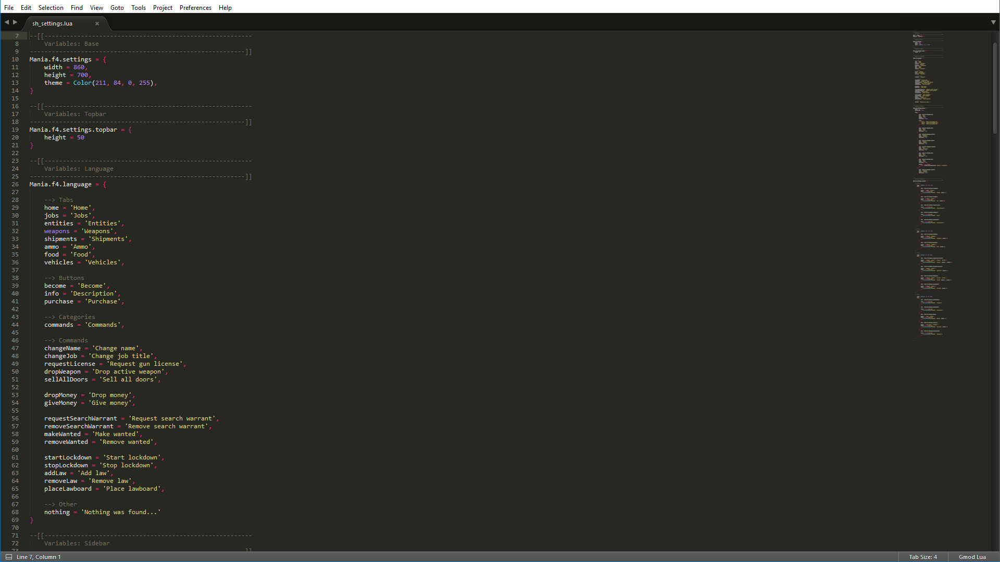    |  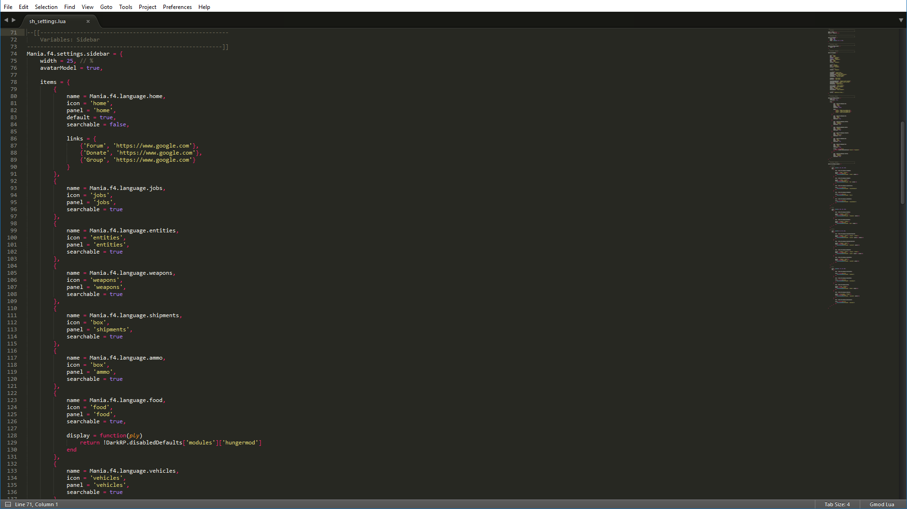  |   | 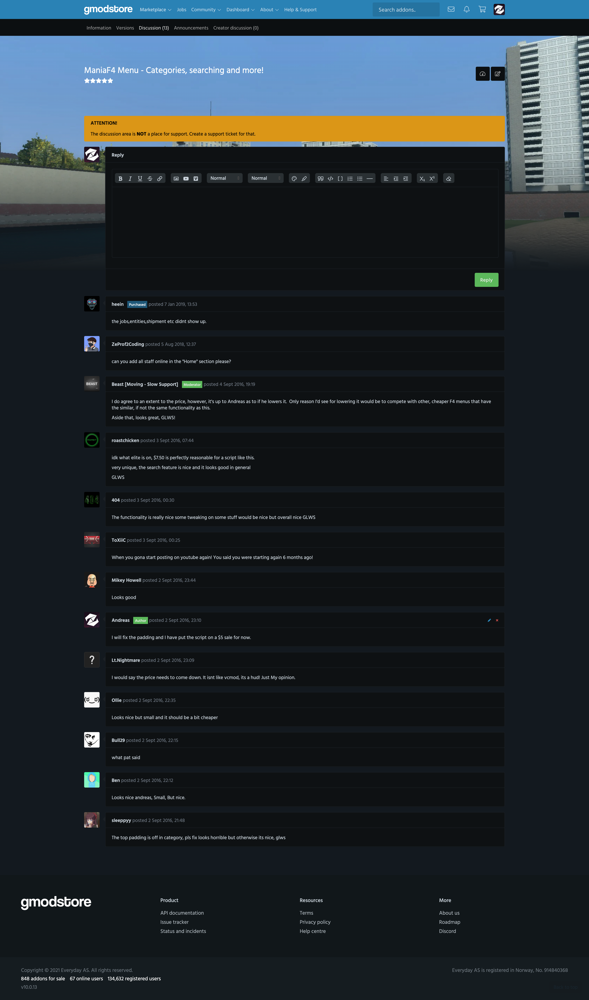

