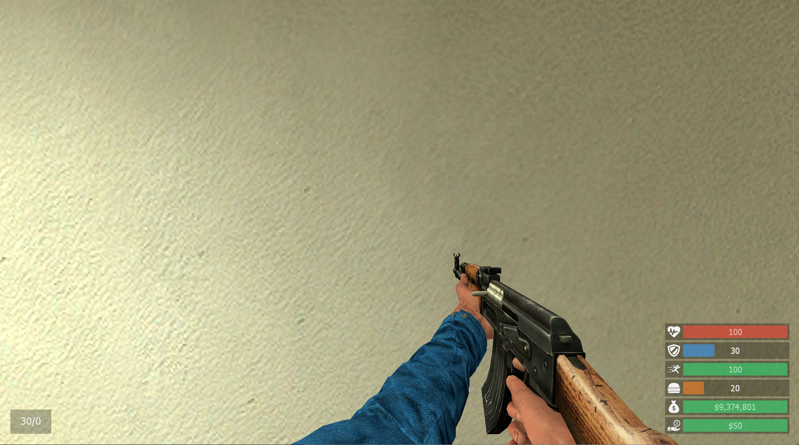
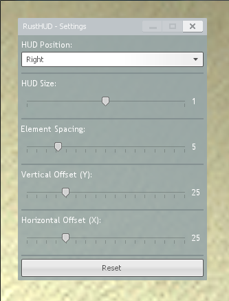
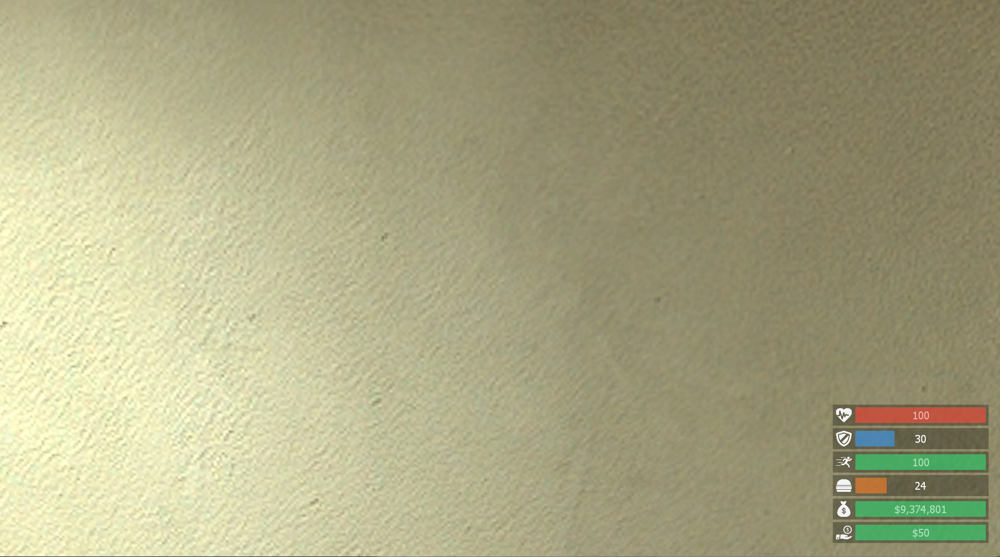
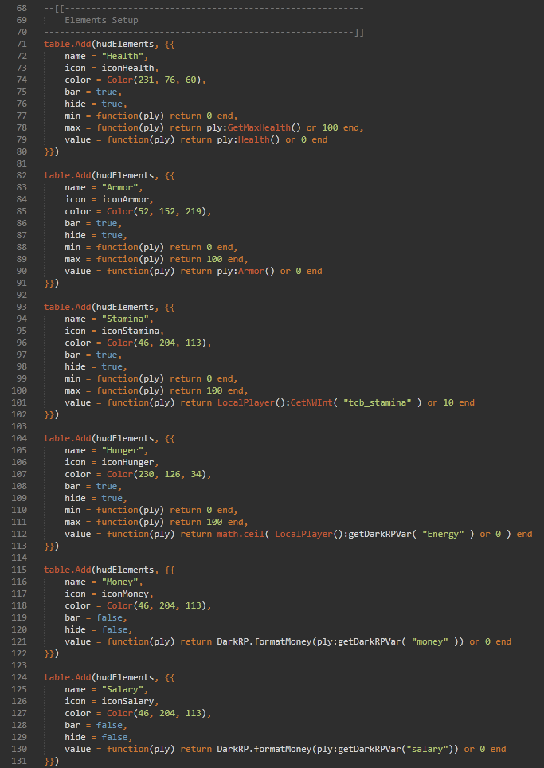
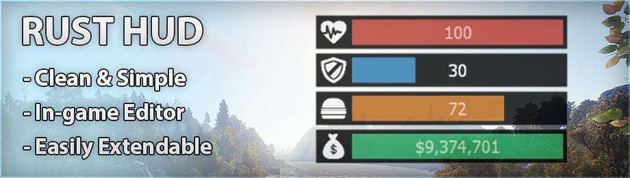
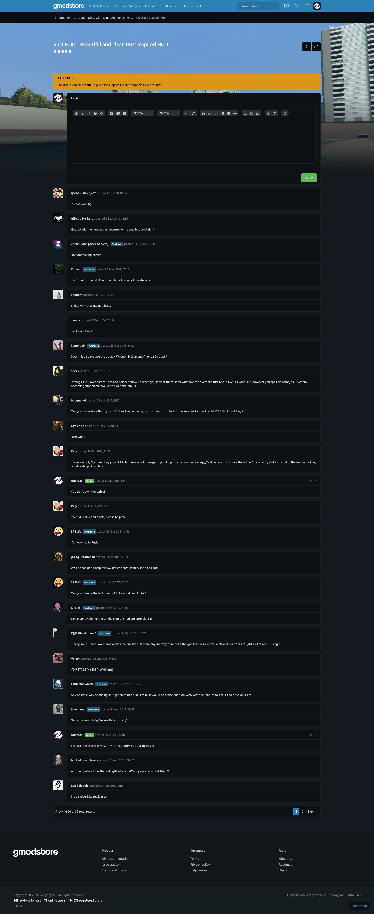
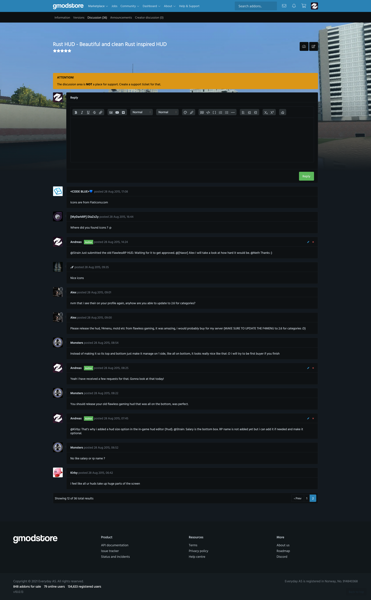

# Rust HUD - Beautiful and clean Rust inspired HUD (1.0)

> [GmodStore Product Page](https://www.gmodstore.com/market/view/tcb-premium-rust-hud)  
Sales: 653  | Price: 4.99 USD  
Added: 28 Aug 2015, 06:37  
Updated: 28 Aug 2015, 00:02

Rust HUD is a clean and simple rust inspired replacement for the default DarkRP HUD.

## Requirements
- DarkRP 2.5 and higher
- DarkRP Modification
- FastDL Setup

## Elements
The following elements is redesigned:
- On-screen player HUD
- Weapon ammo display
- Lockdown and Arrested display

An in-game editor is also available to user via "!hud".

## Modules
The addon provides support for the following modules:
- Hungermod (Requirement: Enabled in disabled_defaults)
- Stamina (Requirement: TCB Stamina installed - [http://www.thecodingbeast.com/products](http://www.thecodingbeast.com/products))

## Installation
1. Upload the 'materials' folder to the main Garry's mod folder 'garrysmod/'.
2. Upload the 'rust_hud' folder to 'garrysmod/addons/darkrpmodification/lua/darkrpmodules/'.
3. Sync the FastDL server with the new font (skip if sv_allowdownload is enabled - not suggested)
4. Restart the server.

## Media
|  |   |   | 
|---|---|---|---|
|   |     |    |  
|  | 
