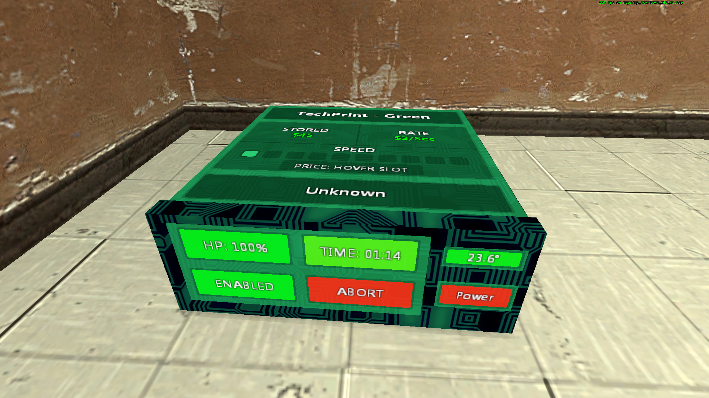
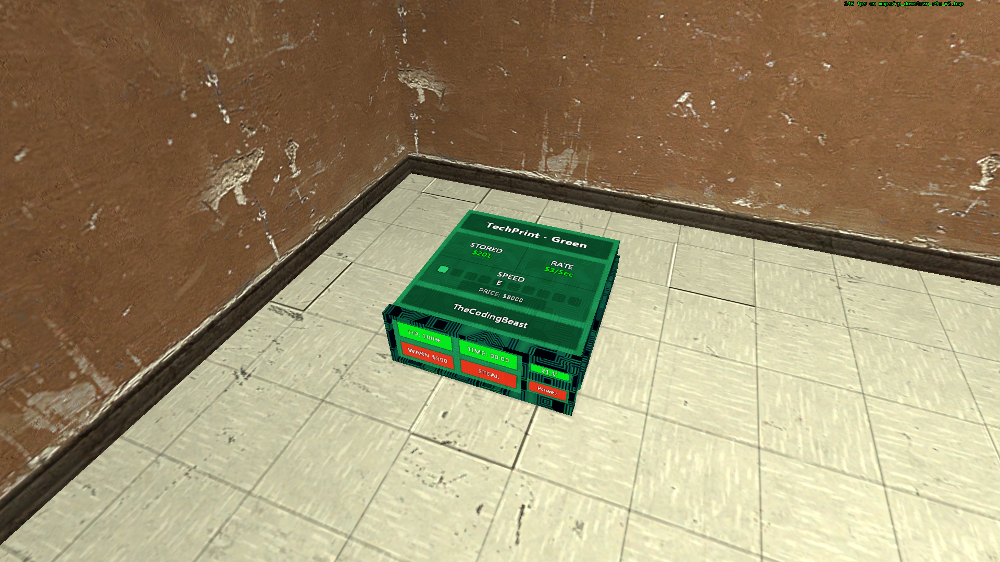
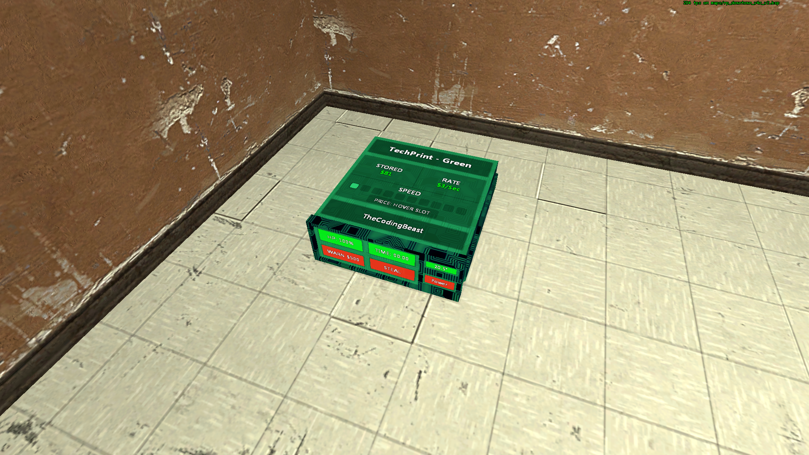
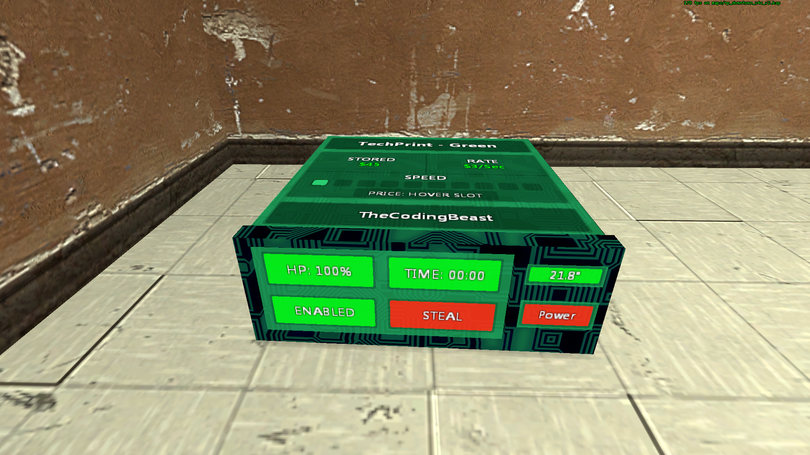
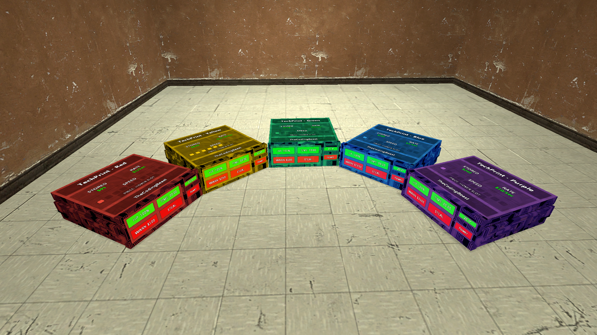
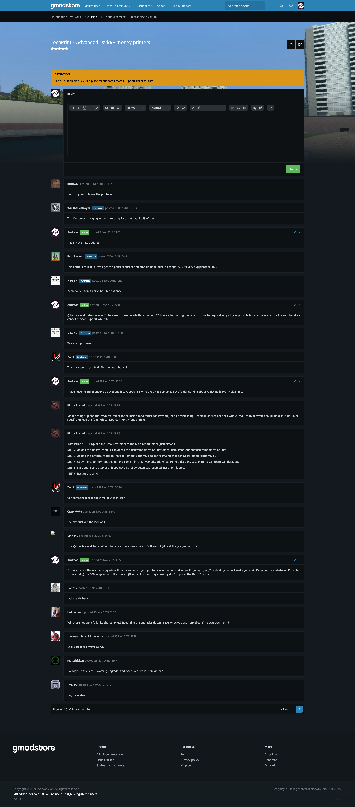
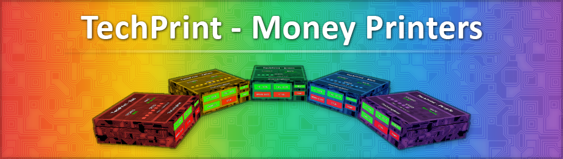

# TechPrint - Advanced DarkRP money printers (1.6)

> [GmodStore Product Page](https://www.gmodstore.com/market/view/tcb-premium-techprint)  
Sales: 354  | Price: 5.00 USD  
Added: 	25 Nov 2015, 16:10  
Updated: 29 Oct 2016, 22:43

TechPrint is a money printer base created for DarkRP 2.5+. The main idea behind the printers is to have all the functionality directly on the printer.

## Requirements
- DarkRP 2.5 and higher
- DarkRP Modification

## Features
- Stored money
- Speed upgrades
- Warning upgrade
- Steal system
- Temperature system
- Easily create custom printers

## Installation
1. Upload the 'resource' folder to the main Garry's mod folder 'garrysmod/'.
2. Upload the 'darkrp_modules' and 'entities' folders to 'garrysmod/addons/darkrpmodification/lua/'.
3. Copy and paste the code from 'entities.lua' into 'garrysmod\addons\darkrpmodification\lua\darkrp_customthings\entities.lua'.
4. Sync the FastDL server with the new font (skip if sv_allowdownload is enabled - not suggested)
5. Restart the server.

You can change the global settings in: 'garrysmod\addons\darkrpmodification\lua\entities\tcb_techprint_base\shared.lua'.  
And the settings for each printer: 'garrysmod\addons\darkrpmodification\lua\entities\tcb_techprint_<name>\shared.lua'.

## Media
|  |   |   | 
|---|---|---|---|
|  |   |   |   
|  |  |  
