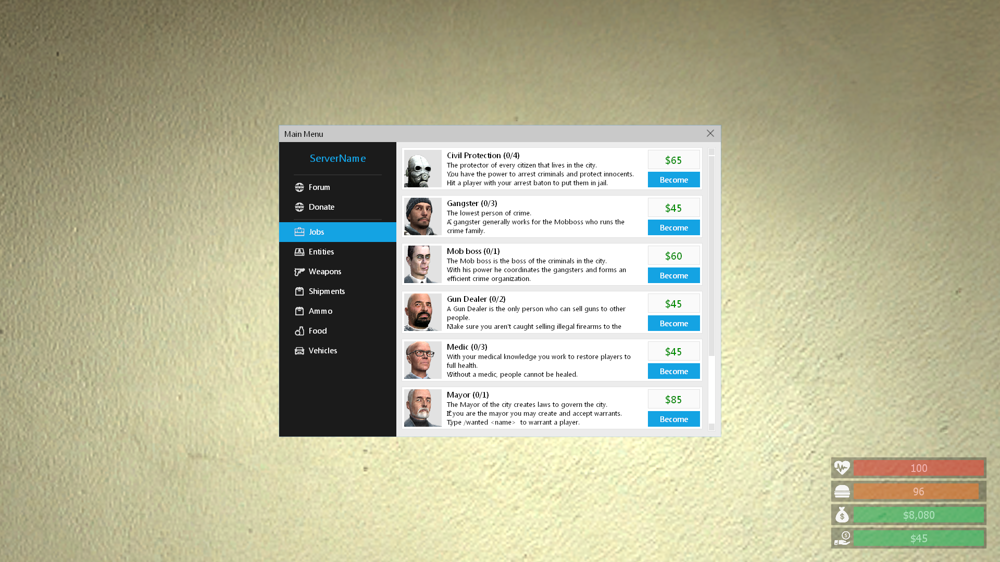
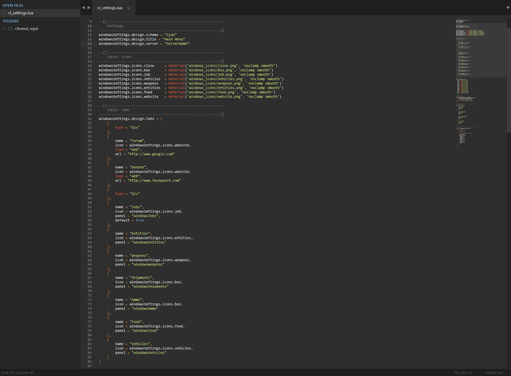
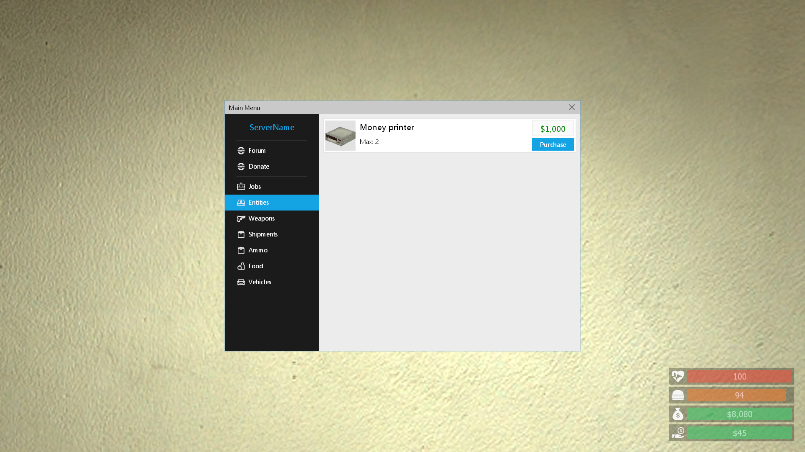
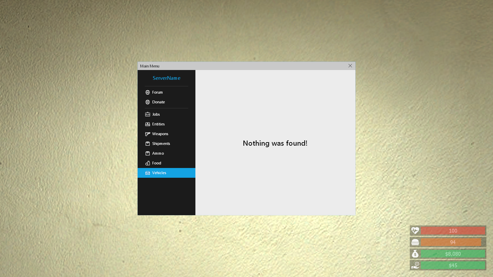
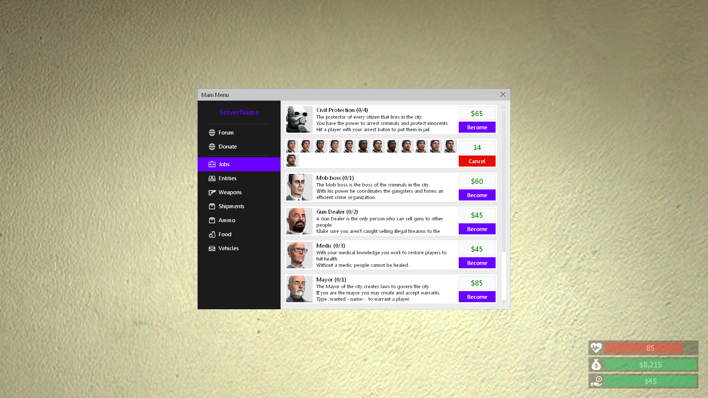
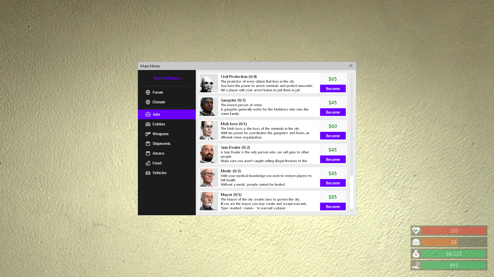
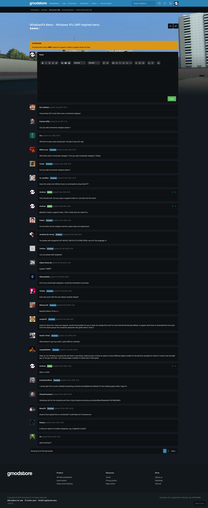
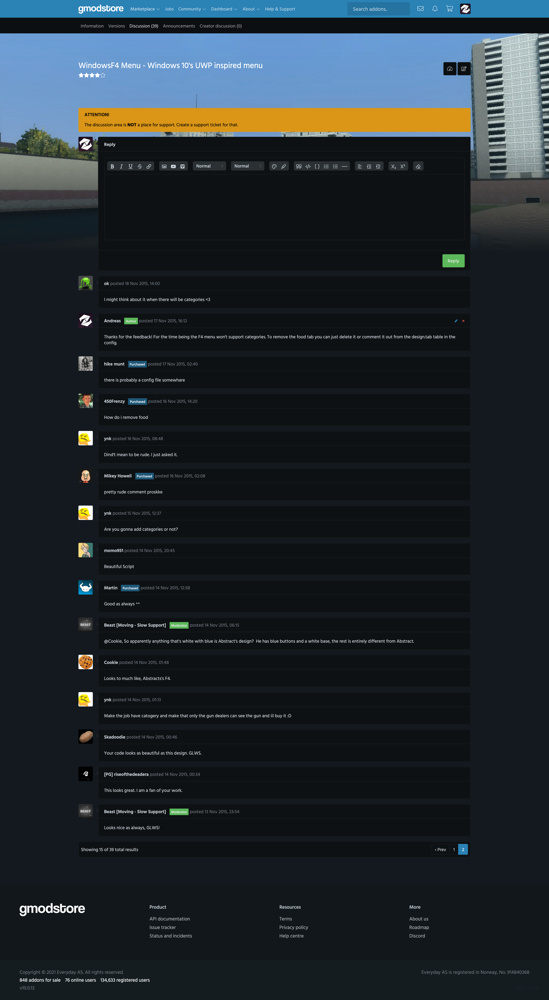
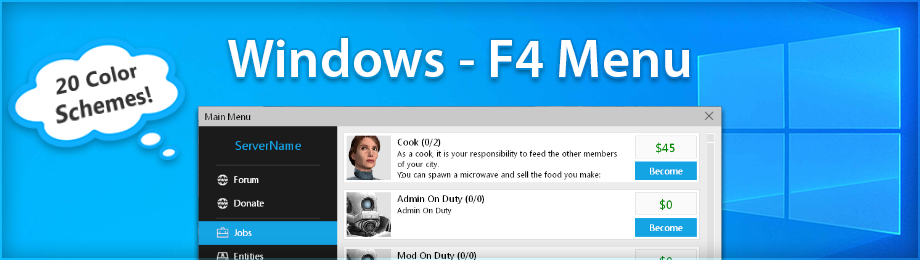

# WindowsF4 Menu - Windows 10's UWP inspired menu (1.2)

> [GmodStore Product Page](https://www.gmodstore.com/market/view/tcb-premium-windows-f4)  
Sales: 381  | Price: 4.99 USD  
Added: 13 Nov 2015, 22:55  
Updated: 2 Mar 2016, 23:21

WindowsF4 is an F4 Menu created for DarkRP 2.5+ and is inspired by the Windows 10 window design.

## Requirements
- DarkRP 2.5 and higher
- DarkRP Modification

## Tabs
The following tabs is available:
- Website tabs (Forum, Donate etc.)
- Jobs
- Entities
- Weapons
- Shipments
- Ammo
- Food
- Vehicles

## Installation
1. Upload the 'resource' folder to the main Garry's mod folder 'garrysmod/'.
2. Upload the 'windowsF4' folders to 'garrysmod/addons/darkrpmodification/lua/darkrpmodules/'.
3. Disable the default DarkRP F4Menu in 'garrysmod/addons/darkrpmodification/lua/darkrp_config/disabled_defaults.lua'.
4. Sync the FastDL server with the new font (skip if sv_allowdownload is enabled - not suggested)
5. Restart the server.

You can change settings in: 'garrysmod\addons\darkrpmodification\lua\darkrpmodules\windowsF4\cl_settings.lua'

## Media
|  |   |   | 
|---|---|---|---|
|  |   |   |   
|  |  |   |   
